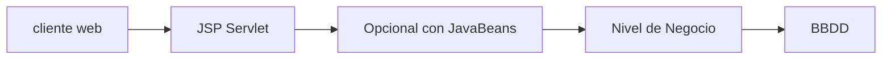

# Introducción a Java

Java siempre se ha vendido como una plataforma segura, con la aparición de .Net, Java se centro en favorecer la migración a Java mismo.

Se apunta a que las aplicaciones (enterprise) se diseñen, construyan y produzcan con -dinero, +velocidad y -recursos.

La plataforma Java EE utiliza un modelo de aplicación distribuida de varios niveles. 

<https://docs.oracle.com/javaee/7/java-ee001.htm>: Ver overview

<https://docs.oracle.com/en/middleware/fusion-middleware/weblogic-server/14.1.2/jeemg/index.html>

El modelo de App EE plantea aplicaciones orientadas a presentacion y orientadas a servicios.

En restfull en la web todo se considera un recurso.

## Componentes Web

Capa cliente: Aplicaciones clientes (la mayor parte del software corre en la maquina cliente, salvo por los datos de la BBDD) y applet o cliente web (Se trabaja con html css y js).
Capa servidor:
- Componentes web que corren sobre el servidor. Si es cliente web, aqui habra que hacer incapie en la seguridad.
- Nivel Negocio.
Capa de la BBDD.

- Servlet: clases que procesan peticiones en el servidor.
- Java server page: archivos de texto plano jsp.
- Java server face: libreria que casi no se usa, que intenta competir con las herramientas de diseño front. Solo hay que informarse.



Los componentes java corren sobre un servidor que los entienda:

- tomcat apache, glassfish, resin
- servidores compatibles con apps j2ee

Puede haber problemas segun los componentes que se usen. El primer problema es encontrar un servidor que permita los componentes persistentes.

## Desarrollo

1. Escribir y compilar el codigo servlet o jsp: Crear la estructura de carpetas y subcarpetas para conservar el codigo fuente separado del codigo compilado.
2. Crear un recurso estatico
3. Crear el descriptor de despliegue web.xml
4. Construir la aplicacion web en .war
5. Desplegar la aplicacion

## Netbeans

Ya ofrece servidores integrados.

## Recursos

Ver las diferencias entre EE7 y Jacarta

## Instalación

- Ingresar a <https://www.oracle.com/latam/java/technologies/downloads/> y descargar el .deb
- Instalar con: `sudo dpkg -i jdk-24_linux-x64_bin.deb`
- Descargar de <https://netbeans.apache.org/front/main/download/nb25/> el .deb.
- Instalar con `sudo dpkg -i apache-netbeans_25-1_all.deb`
- Dar permisos para tomcat:
```sh
sudo groupadd tomcat
sudo useradd -s /bin/false -g tomcat -d /opt/tomcat tomcat
sudo mkdir /opt/tomcat
```
- Estando en la carpeta de descargas:
```sh
curl -O https://dlcdn.apache.org/tomcat/tomcat-10/v10.1.44/bin/apache-tomcat-10.1.44.tar.gz
sudo tar xzvf apache-tomcat-10.1.44.tar.gz -C /opt/tomcat --strip-components=1
```
- Ajustar permisos:
```sh
sudo chown -R tomcat: /opt/tomcat
sudo bash -c 'chmod +x /opt/tomcat/bin/*.sh'
```
- Crear el servicio: `sudo nano /etc/systemd/system/tomcat.service` y añadir:
```ini
[Unit]
Description=Apache Tomcat Web App Container
After=network.target

[Service]
Type=forking
User=tomcat
Group=tomcat
Environment="JAVA_HOME=/usr/lib/jvm/jdk-24.0.2-oracle-x64"
Environment="CATALINA_HOME=/opt/tomcat"
Environment="CATALINA_BASE=/opt/tomcat"
Environment="CATALINA_PID=/opt/tomcat/temp/tomcat.pid"
Environment="CATALINA_OPTS=-Xms512M -Xmx1024M"
ExecStart=/opt/tomcat/bin/startup.sh
ExecStop=/opt/tomcat/bin/shutdown.sh
Restart=always

[Install]
WantedBy=multi-user.target

```

Por ultimo crear los demonios y abrir el firewall:

```sh
sudo systemctl daemon-reload
sudo systemctl start tomcat
sudo systemctl enable tomcat
sudo systemctl status tomcat
sudo ufw allow 8080
```

La ubicación de tomcat puede generar problemas de permisos con netbeans, en lugar de instalarlo (descomprimirlo) bajo opt, seria mejor hacerlo bajo home o tmp, y configurar el tomcat.service de acuerdo a esas carpetas.

El usuario y contraseña se encuentra en `/tomcat/conf/users.xml`.

