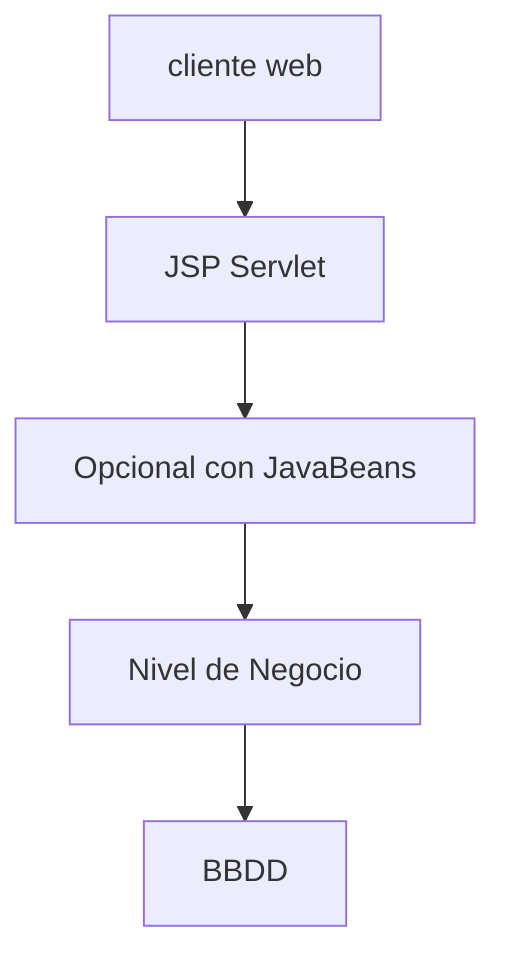

# Introducción a Java

## **El Contexto Histórico: La "Guerra de Plataformas"**

### **Java vs .NET: La Competencia que Cambió Todo**

**Situación inicial (finales 90s-2000s):**

- Java dominaba el mercado enterprise, pero era muy complejo y requería mucho código manual, con extensas y complicadas configuraciones XML. Pero se vendía como una plataforma inherentemente segura, ya que los applets corrían en un entorno aislado, al no haber punteros se eliminaban los error de memoria, existía un garbage collector y una verificación de bytecode.
> [!INFO]
> La verificación de bytecode es un proceso que realiza la JVM para analizar y validar el bytecode generado antes de ejecutarlo. Esto permite asegurar que se cumple con las reglas de seguridad y tipado en Java sin necesidad de acceder al código fuente original.
- Java contaba con dos ediciones: SE (standard edition) y EE (enterprise edition), de forma que la prime contaba con las APIs mínimas para el desarrollo de aplicaciones de escritorio y básicas, y la versión enterprise añadia APIs y servicio para sistemas empresariales distribuidos y de gran escala.
- Además Java se posicionaba como "Write Once, Run Anywhere" - seguro y multiplataforma
- Microsoft lanza .NET Framework (2002) como competencia directa, el cual ofrecía un desarrollo más rápido y herramientas más amigables.
- Con la aparición de .NET, Java comienza a sufrir una serie de cambios, que copian las mejores ideas de .NET, adoptando un modelo de desarrollo más declarativos, con menos boilerplate code y mejorando la experiencia de los desarrolladores.
>[!INFO]
>El boilerplate code es el código repetitivo y básico que se necesitaba en java y que a veces no tenia funcionalidad mas allá de la declarativa, por ejemplo métodos dentro de clases que estaban vacíos.
- Las nuevas estrategias para java consistían en -dinero, +velocidad y -recursos:
	- **Reducir costos (-dinero):** La plataforma se hizo gratuita y open source, se paso de un stack de tecnologias muy caras a un stack gratuito, usando linux, apache tomcat, MySql, IDEs gratuitos, etc.
	- **Acelerar el desarrollo (+velocidad):** Se ofrecen APIs estandarizadas (para no reinventar la rueda), convenciones de configuración, contenedores que manejan de forma automatica la complejidad, etc.
	- **Optimización de recursos:** Se mejora la gestión de la memoria, hay un pooling de conexiones automático, se puede escalar horizontalmente.

Finalmente en 2017, Oracle dona la plataforma Enterprise a Eclipse Foundation, pero la marca Java seguia registrada bajo Oracle, por lo tanto se le cambia el nombre de Java EE a Jakarta EE, y se volvio open source.

## Modelo de las Apps EE

La plataforma Java EE o Jakarta EE utiliza un modelo de aplicación distribuida de varios niveles. La aplicación se divide en componentes especializados, que se ejecutan en diferentes máquinas físicas o virtuales, distribuyendo la carga y responsabilidades según su función específica.

Jakarta es una serie de tecnologias y especificaciones que se montan sobre Java (las librerias básicas).

Un servicio REST en Jakarta se trabaja con JAX-RS, mientras que un servicio SOAP se trabaja con JAX-WS.


### Componentes

#### JSP

Los JSP son componentes que generan contenido HTML dinámico mezclando código Java con markup HTML. Se ejecutan en el servidor web y actúan como plantillas que reciben datos de los Servlets para mostrar información al usuario.

Generalmente un Servelet procesa la lógica y luego redirige a un JSP, pasándole los datos necesarios para que se genere el HTML final que se envía al navegador, es decir que renderiza la página del lado del servidor. Es similar a lo que sucede con Blade en Laravel, pero esto es para el ecosistema de Jakarta EE.

#### Servlets

Los Servlets son componentes que manejan las peticiones HTTP (GET, POST, etc.) y generan respuestas dinámicas para los clientes web. Se ejecutan en el servidor web y actúan como intermediarios entre el navegador del usuario y la lógica de negocio.

Generalmente un Servlet tiene inyectados EJBs o servicios, y desde el navegador se hace una petición HTTP al servidor web. El Servlet procesa la petición, coordina con otros componentes (como EJB) y envía la respuesta de vuelta al cliente. Es decir, tienen un comportamiento similar a los Controladores, pero dentro del ecosistema Jakarta EE.

#### JSF

Los JSF o JavaServer Faces es un framework que gestiona automaticamente el ciclo de vida de las paginas, validación de datos, conversión de datos y el binding entre la interfaz HTML y los beans. Surgio en reemplazo de JSP+Servlet y ofrecen un comportamiento similar a frameworks como React, Vue o Angular, pero con la diferencia fundamental de que el renderizado se realiza del lado del servidor y no del cliente.


#### EJB

Los Enterprise JavaBeans son componentes que encapsulan la lógica de negocio de las aplicaciones enterprise y se ejecutan en los servidores de aplicaciones. Los tipos principales son Session Beans Stateless o Stateful y Message-Driven Beans (MDB).

Generalmente un Servlet tiene inyectado un EJB, y desde el servidor web se hace una llamada al servidor de aplicaciones. Es decir, tienen un comportamiento similar a los microservicios, pero dentro del ecosistema Jakarta EE.

### Distribución de los componentes

Existen 4 niveles:

1. **Nivel Cliente:** En este nivel se encuentra la interfaz de usuario y esta se ejecuta en la computadora cliente. Puede funcionar en un navegador, o ser una aplicación móvil o de escritorio.
2. **Nivel Web:** En este nivel se manejan las peticiones HTTP y se genera el contenido web dinámico. Se ejecuta en el servidor web y actúa como intermediario entre el cliente y la lógica de negocio. Incluye componentes como Servlets, JSP y controladores REST que procesan las solicitudes del usuario y preparan las respuestas. Este nivel se ejecuta sobre el servidor Apache Tomcat.
3. **Nivel de Negocio:** En este nivel se implementa toda la lógica de negocio y las reglas empresariales de la aplicación. Se ejecuta en el servidor de aplicaciones y contiene componentes como EJB que procesan transacciones, validan datos, aplican reglas de negocio y coordinan operaciones complejas sin preocuparse por la presentación o persistencia. Este nivel se ejecuta sobre el servidor de aplicaciones que puede ser JBoss o GlassFish.
4. **Nivel de Datos:** En este nivel se persisten los datos y se trabaja con un servidor de base de datos.


<https://docs.oracle.com/javaee/7/firstcup/java-ee001.htm>: Ver overview

<https://docs.oracle.com/en/middleware/fusion-middleware/weblogic-server/14.1.2/jeemg/index.html>

El modelo de App EE plantea aplicaciones orientadas a presentacion y orientadas a servicios.

En restfull en la web todo se considera un recurso.

## Componentes Web

Capa cliente: Aplicaciones clientes (la mayor parte del software corre en la maquina cliente, salvo por los datos de la BBDD) y applet o cliente web (Se trabaja con html css y js).
Capa servidor:
- Componentes web que corren sobre el servidor. Si es cliente web, aqui habra que hacer incapie en la seguridad.
- Nivel Negocio.
Capa de la BBDD.

- Servlet: clases que procesan peticiones en el servidor.
- Java server page: archivos de texto plano jsp.
- Java server face: libreria que casi no se usa, que intenta competir con las herramientas de diseño front. Solo hay que informarse.



Los componentes java corren sobre un servidor que los entienda:

- tomcat apache, glassfish, resin
- servidores compatibles con apps j2ee

Puede haber problemas segun los componentes que se usen. El primer problema es encontrar un servidor que permita los componentes persistentes.

## Desarrollo

1. Escribir y compilar el codigo servlet o jsp: Crear la estructura de carpetas y subcarpetas para conservar el codigo fuente separado del codigo compilado.
2. Crear un recurso estatico
3. Crear el descriptor de despliegue web.xml
4. Construir la aplicacion web en .war
5. Desplegar la aplicacion

## Netbeans

Ya ofrece servidores integrados.

## Recursos

Ver las diferencias entre EE7 y Jacarta

## Instalación

- Ingresar a <https://www.oracle.com/latam/java/technologies/downloads/> y descargar el .deb
- Instalar con: `sudo dpkg -i jdk-24_linux-x64_bin.deb`
- Descargar de <https://netbeans.apache.org/front/main/download/nb25/> el .deb.
- Instalar con `sudo dpkg -i apache-netbeans_25-1_all.deb`
- Dar permisos para tomcat:
```sh
sudo groupadd tomcat
sudo useradd -s /bin/false -g tomcat -d /opt/tomcat tomcat
sudo mkdir /opt/tomcat
```
- Estando en la carpeta de descargas:
```sh
curl -O https://dlcdn.apache.org/tomcat/tomcat-10/v10.1.44/bin/apache-tomcat-10.1.44.tar.gz
sudo tar xzvf apache-tomcat-10.1.44.tar.gz -C /opt/tomcat --strip-components=1
```
- Ajustar permisos:
```sh
sudo chown -R tomcat: /opt/tomcat
sudo bash -c 'chmod +x /opt/tomcat/bin/*.sh'
```
- Crear el servicio: `sudo nano /etc/systemd/system/tomcat.service` y añadir:
```ini
[Unit]
Description=Apache Tomcat Web App Container
After=network.target

[Service]
Type=forking
User=tomcat
Group=tomcat
Environment="JAVA_HOME=/usr/lib/jvm/jdk-24.0.2-oracle-x64"
Environment="CATALINA_HOME=/opt/tomcat"
Environment="CATALINA_BASE=/opt/tomcat"
Environment="CATALINA_PID=/opt/tomcat/temp/tomcat.pid"
Environment="CATALINA_OPTS=-Xms512M -Xmx1024M"
ExecStart=/opt/tomcat/bin/startup.sh
ExecStop=/opt/tomcat/bin/shutdown.sh
Restart=always

[Install]
WantedBy=multi-user.target

```

Por ultimo crear los demonios y abrir el firewall:

```sh
sudo systemctl daemon-reload
sudo systemctl start tomcat
sudo systemctl enable tomcat
sudo systemctl status tomcat
sudo ufw allow 8080
```

La ubicación de tomcat puede generar problemas de permisos con netbeans, en lugar de instalarlo (descomprimirlo) bajo opt, seria mejor hacerlo bajo home o tmp, y configurar el tomcat.service de acuerdo a esas carpetas.

El usuario y contraseña se encuentra en `/tomcat/conf/users.xml`.

