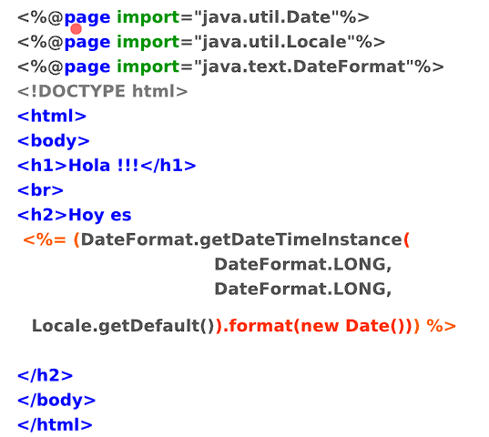
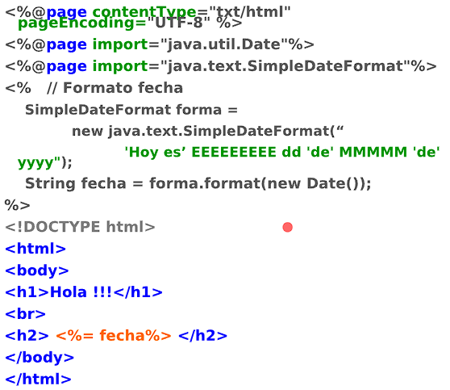
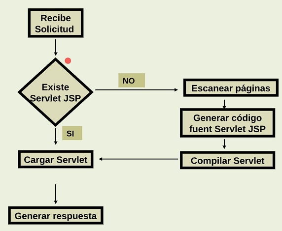
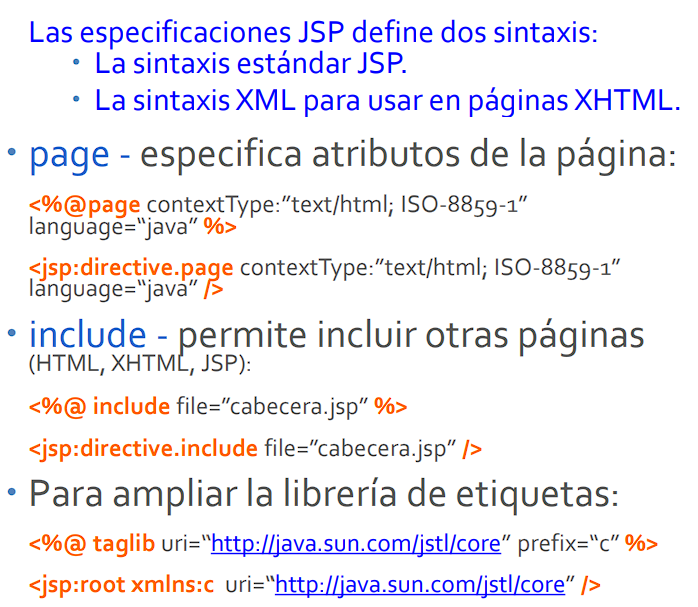
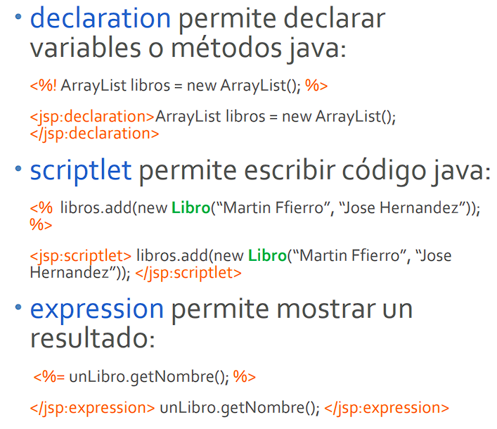
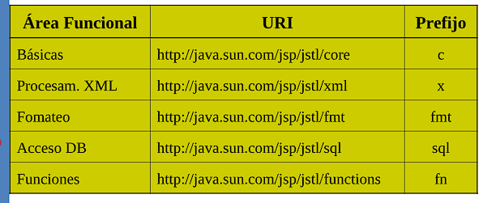
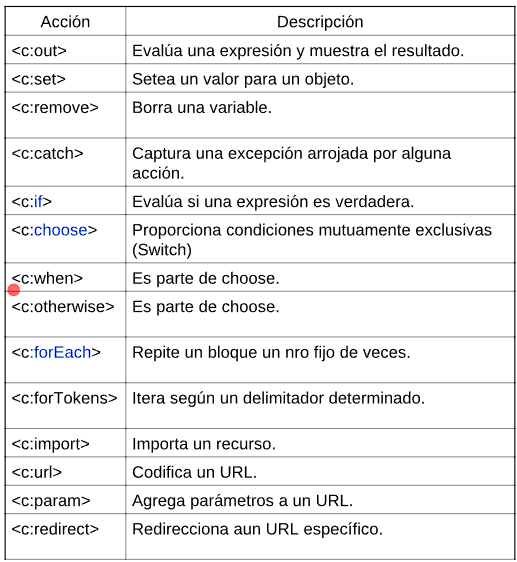
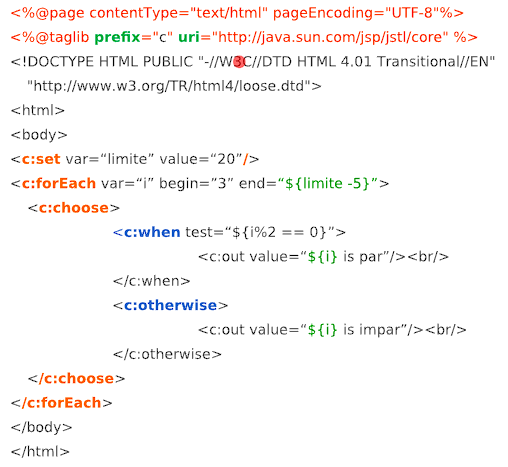
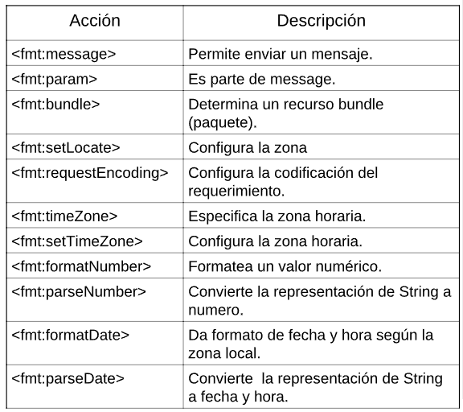
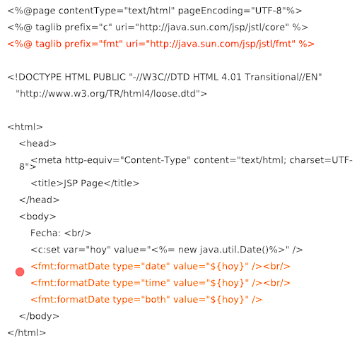

# Clase 05

## JSP

JavaServer Pages (JSP) es una tecnología que ayuda a los desarrolladores a crear contenido dinámico para la web. JSP permite insertar código Java en páginas HTML, lo que facilita la creación de aplicaciones web interactivas.

Básicamente es un documento basado en texto, capaz de retornar contenido dinámico y estático a un cliente web, generalmente un navegador. Contiene código HTML, XML o texto, y fragmentos de código Java que se ejecutan en el servidor.

El código XML se usa para desplegar propiedades de los objetos JavaBeans.

### Características de JSP
- **Simplicidad**: Permite a los desarrolladores web crear contenido dinámico utilizando una sintaxis similar a HTML.
- **Separación de contenido y lógica**: JSP promueve la separación entre la presentación y la lógica de negocio, lo que facilita el mantenimiento del código.
- **Integración con Java**: Al estar basado en Java, JSP se integra fácilmente con otras tecnologías de Java, como Servlets y JavaBeans.

### Estructura de un archivo JSP
Un archivo JSP tiene una extensión `.jsp` y puede contener:
- **Directivas**: Instrucciones que afectan el procesamiento de la página, como la declaración de variables.
- **Elementos de scriptlet**: Código Java que se ejecuta en el servidor y puede interactuar con el contenido HTML.
- **Expresiones**: Permiten mostrar valores dinámicos en la página.

### Ejemplo de un archivo JSP
```jsp
<%@ page language="java" contentType="text/html; charset=UTF-8" pageEncoding="UTF-8"%>
<!DOCTYPE html>
<html>
<head>
    <title>Ejemplo JSP</title>
</head>
<body>
    <h1>Hola, mundo!</h1>
    <%
        String nombre = "Juan";
        out.println("Bienvenido, " + nombre);
    %>
</body>
</html>
```

En un proyecto web, simplemente con renombrar el index.html a index.jsp, ya se puede empezar a usar JSP.

## Código Java en JSP

Se utilizan tres tipos de tags para incluir código Java en un archivo JSP:
1. **Scriptlets**: Permiten insertar bloques de código Java que se ejecutan cuando se procesa la página JSP. Se delimitan con `<%` y `%>`.
   ```jsp
   <%
       // Código Java aquí
       String mensaje = "Hola desde un scriptlet!";
       out.println(mensaje);
   %>
   ```

2. **Declaraciones**: Permiten declarar variables y métodos que estarán disponibles en toda la página JSP. Se delimitan con `<%!` y `%>`.
   ```jsp
   <%! int contador = 0; %>
   ```

3. **Expresiones**: Permiten mostrar valores dinámicos en la página. Se delimitan con `<%= ` y `%>`.
   ```jsp
   <%= "Hola desde una expresión!" %>
   ```

Ejemplo:

Expresión:
 

Scriptlet:


## Como funciona el JSP

- El contenedor (servidor Java) busca etiquetas JSP, generando el código Java correspondiente para cada una de ellas.
- Las etiquetas estáticas HTML son convertidas a Strings de Java.
- Las etiquetas que hacen referencia a JavaBeans son traducidas en los correspondientes objetos y llamadas a métodos.
- Se construye el código del servlet (se codifica su método service()). Convierte el archivo JSP en un servlet, esto significa que el código JSP se transforma en código Java.
- Se llama al compilador de Java para compilar el código fuente y añade el fichero de bytecodes resultante al directorio apropiado del contenedor JSP.
- El contenedor invoca al servlet para generar la respuesta al usuario.

## Ciclo de vida de un JSP



## Solicitudes a JSP

Usar por ejemplo `http://localhost:8080/miweb/index.jsp` lo que hace es acceder/llamar a un archivo JSP. Entonces por ejemplo:
- En javascript se puede hacer `fetch('ahora.jsp')` y lo que hace es llamar a ese archivo JSP.
- En un formulario HTML, si se pone `action="procesar.jsp"` lo que hace es llamar a ese archivo JSP cuando se envía el formulario.

Es decir que jsp funciona exactamente igual que un archivo HTML, PHP, ASP, etc.

Esto también quiere decir que los JSP puede recibir parámetros por URL, por ejemplo `http://localhost:8080/miweb/index.jsp?nombre=Juan&edad=25`, o por formulario (GET o POST).

La respuesta es lo que sea que se genere con el JSP, que puede ser HTML, JSON, XML, texto plano, etc.

## Diferencias entre JSP y Servlets

Hay ventajas en JSP que no están presentes en los Servlets, y viceversa.

Por ejemplo:
- **JSP**:
  - El código es público y puede ser visto por cualquiera que acceda al archivo JSP.
  - Más fácil de escribir y mantener para páginas con mucho contenido HTML.
  - Permite a los diseñadores web trabajar en la presentación sin necesidad de conocimientos profundos de Java.
  - Ideal para páginas web que requieren una gran cantidad de contenido estático con algunas partes dinámicas.
- **Servlets**:
  - El código fuente no es accesible directamente desde el navegador, lo que mejora la seguridad.
  - Escribir el contenido HTML puede ser tedioso y propenso a errores, y hay que usar `out.println()` para cada línea de HTML y realizar muchas concatenaciones.
  - Más adecuado para manejar la lógica de negocio compleja y el procesamiento de datos.
  - Ofrece un mayor control sobre la gestión de solicitudes y respuestas HTTP.
  - Mejor rendimiento para aplicaciones que requieren un procesamiento intensivo en el servidor.
  - Más fácil de depurar y probar, ya que el código está completamente en Java.

> Netbeans resuelve los CLASSPATH automáticamente, por fuera hay que setearlos y los JSP no lo requieren.

No es buena idea tener todo el código en JSP ni siquiera llamar código Java de forma indirecta.
Hay que tener cuidado si se tiene la lógica en Servlets y solo la presentación en JSP, también si se usan etiquetas propias.
Hay que aprovechar las etiquetas personales JSTL (Java Standard Tag Library) y las etiquetas personalizadas (Custom Tags).
Seguir el patron MVC (Modelo-Vista-Controlador). El controlador es un Servlet, la vista es un JSP y el modelo son los JavaBeans.
Seguir el framework Model2 (una evolución del MVC, que usa Struts, JSF, Echo, Tapestry, WebWork y Wicket). La cátedra no usa ningún framework.

Puede haber muchos servlets escuchando en el servidor (controlar) y tomar la decision de despachar o redirigir a otros servlets o JSP (vista).
Los JSP solo van a desplegar la vista, no van a tener lógica de negocio.

## Que se puede hacer con JSP

Directivas: `<%@ page language="java" contentType="text/html; charset=UTF-8" pageEncoding="UTF-8" %>`. Esta forma es mas simple, pero no es estricta de XML. Cuando se usa una etiqueta estricta de XML sería: `<jsp:directive.page contextType:”text/html; ISO-8859-1” language=“java” />`.


Scripting: 
```jsp
<%
    String nombre = request.getParameter("nombre");
    out.println("Hola " + nombre);
%>
```



Action: `<jsp:useBean id="miBean" class="com.ejemplo.MiBean" scope="request" />`. 
Pueden ser useBean, setProperty y getProperty, include, forward, plugin, param, params, element, attribute, body, text.

## JSTL (JavaServer Page Standard Tag Library)







Hay que importar la librería en el JSP con `<%@ taglib uri="http://java.sun.com/jsp/jstl/core" prefix="c" %>`

Que ventaja tiene usar JSTL en lugar de scriptlets?
- Mejora la legibilidad del código.
- Facilita el mantenimiento.    
- Promueve la separación de la lógica de negocio y la presentación.
- Reduce la posibilidad de errores de sintaxis.
- Facilita la colaboración entre desarrolladores y diseñadores.

Etiquetas de formato:



