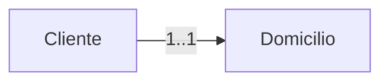
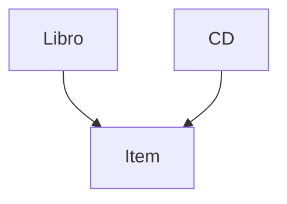

# EJB (Java Beans Enterprise)

Un EJB es un componente del lado del servidor que encapsula la lógica de negocio de una aplicación Java EE. Los EJBs son gestionados por un contenedor EJB, que proporciona servicios como transacciones, seguridad y concurrencia.

No es mas que una clase de java, un simple POJO (Plain Old Java Object) que sigue ciertas convenciones y anotaciones para ser reconocido como un EJB por el contenedor.

Tiene atributos no publicos, al menos un constructor publico sin parametros y metodos publicos acceden a los atributos. Si bien el constructor no es es requerido explicitamente, es una buena práctica incluirlo.

Se tienen que desplegar en un contenedor EJB, como JBoss, Glassfish o WebLogic.

## Tipos de EJB

1. **Session Beans**: Representan la lógica de negocio y pueden ser de dos tipos:
   - **Stateless**: No mantienen estado entre llamadas. Son ideales para operaciones que no requieren mantener información entre invocaciones.
   - **Stateful**: Mantienen estado entre llamadas. Son útiles cuando se necesita conservar información específica del cliente durante una sesión.
2. **Message-Driven Beans (MDB)**: Son componentes que procesan mensajes asíncronos, generalmente de una cola de mensajes (JMS). Permiten la comunicación entre diferentes partes de una aplicación de manera desacoplada.

JPA (Java Persistence API) define complementariamente entidades que representan tablas en la base de datos y permiten mapear objetos Java a registros de la base de datos.

## Diferencia entre JavaBeans y Session Beans

Los javabeans usados hasta el momento eran simples clases java, usados por los servlets, y eran como muy públicos.

- **JavaBean:** Es simplemente una clase Java con atributos privados y métodos públicos getter/setter. No contiene lógica de negocio, solo sirve para representar datos (por ejemplo, un objeto Persona con nombre y edad). Se puede usar en cualquier aplicación Java, sin necesidad de un servidor especial.

- **EJB (Enterprise Java Bean):** Es un bean más avanzado, gestionado por un contenedor EJB (como Glassfish). Además de encapsular lógica de negocio (las reglas y procesos de la aplicación), el contenedor le proporciona servicios empresariales como:
  - **Seguridad:** Controla quién puede acceder a sus métodos.
  - **Transacciones:** Permite agrupar operaciones para que se ejecuten de forma segura.
  - **Concurrencia:** Gestiona el acceso simultáneo de varios usuarios.

## Ventajas de usar EJB

Ofrece los servicios de:
- transacciones y seguridad
- pool de recursos y almacenamiento
- soporte de concurrencia

Cuando se traen los datos desde la bbdd al servidor, es cuando se necesita asegurar la informacion, y esto lo permiten los EJB.

Pero hay que definir su tiempo de vida:
- Aplicacion
- Consulta
- Tiempo determinado

## Tipos de sesiones Beans

- Stateless: No mantienen estado entre llamadas. Son ideales para operaciones que no requieren mantener información entre invocaciones. Es el utilizado por defecto.
- Stateful: Mantienen estado entre llamadas. Son útiles cuando se necesita conservar información específica del cliente durante una sesión. Este se utiliza por ejemplo para mantener el carrito de compras de un usuario, durante la sesion.
- Singleton: Una sola instancia compartida entre todos los clientes. Se utiliza para mantener datos globales o configuraciones de la aplicación. No guardan datos sensibles, que suele existir durante la existencia de la aplicacion.

## Sesion Bean JPA

Hay que combinar las entidades JPA con los EJB para manejar la persistencia de datos en una aplicación Java EE.

El bean de sesion proporciona una interfaz para manipular las entidades, permitiendo tener un CRUD.

Aqui aparece el patron facade.

## Facade

Es una fachada, es un nivel mas de abtraccion, que abstrae las entidades, y expone metodos mas simples para el cliente. Esta fachada permite darle nivel de seguridad a las entidades, y controlar el acceso a los datos.

Aqui es donde se define el nivel de filtro del usuario, es decir, que ciertos usuarios puede acceder solo a ciertos metodos y por lo tanto datos.

La combinacion de EJB y entidades JPA se organiza en las Facades.

## Conclusion

A partir de los EJB, el cliente ya no trabaja directamente con las entidades, son los EJB los que trabajan con las entidades, y el cliente trabaja con los EJB.

## Que genera el JPA

### Relacion UNO A UNO

> [!WARNING]
> Este ejemplo no esta en el PDF, pero es básico.



En JPA se genera lo siguinete:

```java
@Entity
public class Cliente {
      @Id @GeneratedValue
      private Long id;
      private String nombre;
      @OneToOne (fetch=FetchType.LAZY)
      @JoinColumn(name="domicilio_id", nullable=false)
      private Domicilio domicilio;
      // getters y setters
}
```

En este código, el atributo domicilio representa una relación uno a uno entre la entidad Cliente y la entidad Domicilio.

Las directivas hacen lo siguiente:

`@OneToOne(fetch=FetchType.LAZY)`: Indica que la relación entre Cliente y Domicilio es de uno a uno. El parámetro fetch=FetchType.LAZY significa que el objeto Domicilio asociado no se carga automáticamente al consultar un Cliente, sino solo cuando se accede explícitamente a él.
`@JoinColumn(name="domicilio_id", nullable=false)`: Especifica que la columna domicilio_id en la tabla Cliente será la clave foránea que referencia a la tabla Domicilio. El atributo nullable=false indica que este campo no puede ser nulo, es decir, todo cliente debe tener un domicilio asociado.
En resumen, cada instancia de Cliente está asociada a una única instancia de Domicilio, y la relación se gestiona mediante la columna domicilio_id en la base de datos.

### Relacion UNO A MUCHOS

Ver `@OneToMany`. Una facultad se relaciona con muchas carreras.

CascadeType.ALL: Si se elimina la facultad, se eliminan todas las carreras asociadas. El efecto cascada se realiza para todas las operaciones sobre la entidad padre (facultad).

Ver `@ManyToOne`. Muchas carreras pertenecen a una facultad. `@JoinColumn` indica la columna que actua como clave foranea en la tabla carrera. referencedColumnName permite renombrar la columna, para trabajar directamente con `idfacultad` y no con `facultad_idfacultad`, por ejemplo.

### Mapeo de Herencia

En JPA hay tres estrategias o maneras de hacerlo:



1. Una tabla que reune toda la informacion de las clases especializadas. ISBN es nulo en CDs y dicografica en Libros.

2. Usar directiva @Inheritance(), esto crearia una tabla por cada clase, una Item una Libro y una CD, con relaciones entre ellas y Libro y CD no se lleva los atributos de Item.

3. A diferencia de la anterior, no hay relacion, sino que Libro y CD se llevan todos los atributos de Item.

## Generar Facades

Añádir Session Beans for Entity Classes. Se añaden todas, en un package session, por ejemplo.

> [!INFO]
> Las entidades deberian generarse en el package entidad.

En las entidades hay que borrar las NamedQueries, ya que de esto se van a ocupar las Facades.

No es obligatorio borrar las NamedQueries de las entidades, pero es común mover la lógica de consulta a los Facades para mantener las entidades más limpias.

## Ejemplo de EJB con control de acceso

Control de acceso por medio de directivas, es estatico y se configura a nivel de Glassfish.

```java
package com.ejb;

import jakarta.annotation.security.RolesAllowed;
import jakarta.ejb.Stateless;
import java.util.List;
import com.entidad.User;

@Stateless
public class UserSessionBean {

    // Listar usuarios: permitido para admin y user
    @RolesAllowed({"admin", "user"})
    public List<User> listarUsuarios() {
        // ... lógica para listar usuarios ...
        return null; // ejemplo
    }

    // Crear usuario: permitido solo para user
    @RolesAllowed("user")
    public void crearUsuario(User nuevoUsuario) {
        // ... lógica para crear usuario ...
    }

    // Borrar usuario: permitido solo para admin
    @RolesAllowed("admin")
    public void borrarUsuario(Long idUsuario) {
        // ... lógica para borrar usuario ...
    }
}
```

Control de acceso dinamico, se consigue a nivel de los EJB, programando la logica:

```java
package com.ejb;

import jakarta.ejb.Stateless;
import java.util.List;
import com.entidad.User;

@Stateless
public class UserSessionBean {

    public List<User> listarUsuarios(User usuarioActual) {
        // Todos los roles pueden listar
        if (!usuarioActual.getRol().matches("admin|moderador|usuario")) {
            throw new SecurityException("Acceso denegado.");
        }
        // ... lógica para listar usuarios ...
        return null;
    }

    public void crearUsuario(User nuevoUsuario, User usuarioActual) {
        // Solo usuarios registrados pueden crear (por ejemplo)
        if (!usuarioActual.getRol().equals("usuario")) {
            throw new SecurityException("Solo usuarios pueden crear usuarios.");
        }
        // ... lógica para crear usuario ...
    }

    public void borrarUsuario(Long idUsuario, User usuarioActual) {
        // Solo admin puede borrar
        if (!usuarioActual.getRol().equals("admin")) {
            throw new SecurityException("Solo admin puede borrar usuarios.");
        }
        // ... lógica para borrar usuario ...
    }
}
```

## Ver cambios en el manejador y JSP

Diapo 54 y 55

## JPQL

El PDF son simple ejemplos, revisar.

