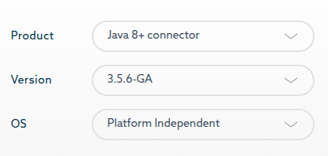
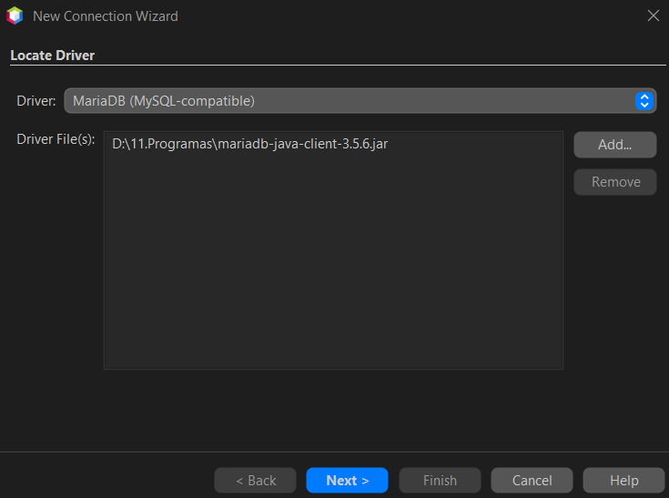
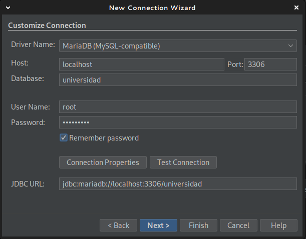
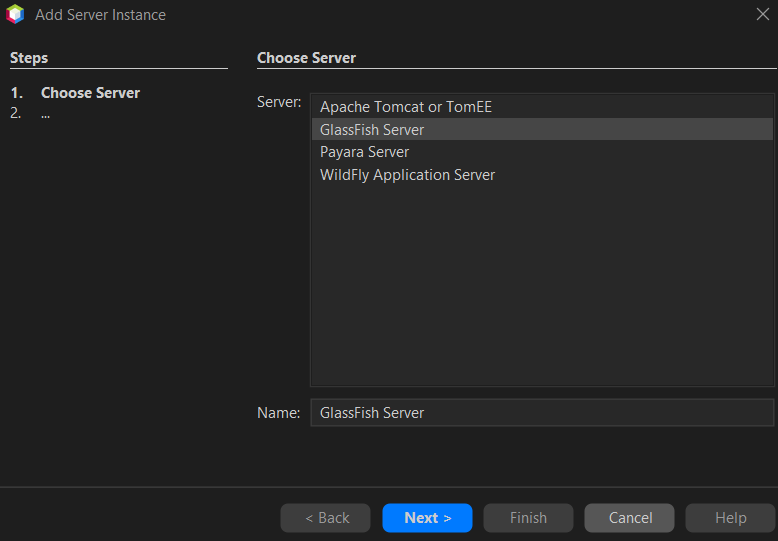
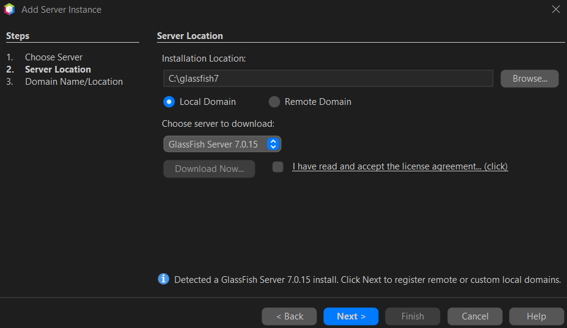
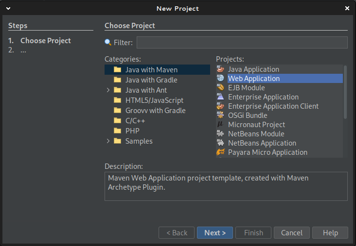
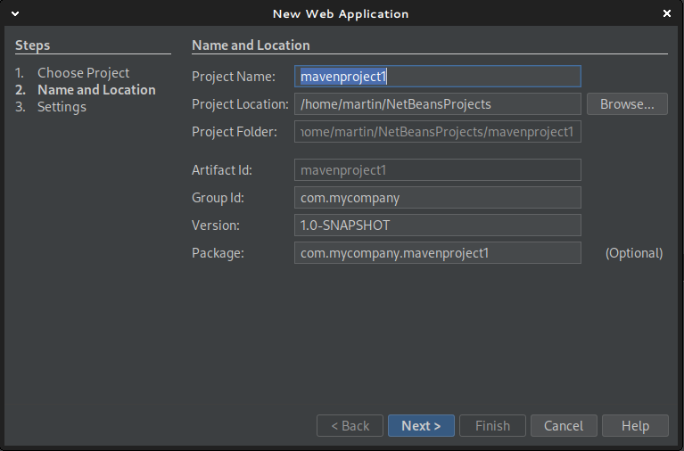
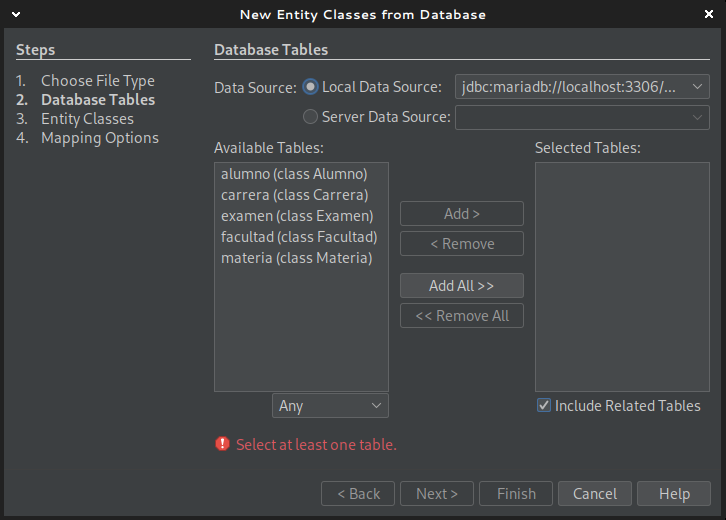
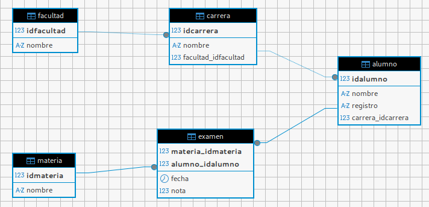

# Proyecto en Maven y Persistencia desde 0

## Requerimientos previos

- Netbeans 25
- JDK 11 (las versiones de JDK pueden convivir sin problemas): 
    - Descargar: <https://www.oracle.com/latam/java/technologies/downloads/#java11>
    - Instalar: `sudo dpkg -i ~/Descargas/jdk-11.0.28_linux-x64_bin.deb`
    - Configurar la Platform en Netbeans: `Tools > Java Platforms > Add Platform > Seleccionar JDK 11`
- Servidor: GlassFish Server 7.0.15 (o 25) (requiere JDK 11, quizas ya esta instalado el JDK 24, pero no sirve), ya incluye Derby
    - Descargar: <https://glassfish.org/download_gf7.html> el que dice `Platform`
    - Mover el archivo zip a la carpeta del usuario: `mv ~/Descargas/glassfish-7.0.15.zip ~/glassfish.zip`
    - Descomprimir (en una carpeta de acceso común, en linux seria la carpeta del usuario):  `unzip ~/glassfish.zip -d ~/` (descomprime en glassfish7)
- BBDD: MariaDB
- Luego configurar mariadb (root password y privilegios):
```sh
ALTER USER 'root'@'localhost' IDENTIFIED BY 'admin1234';
FLUSH PRIVILEGES;
EXIT;
```

> [!INFO]
> En Windows, NetBeans da error si no existe un password para el root. Por lo tanto hay que configurar XAMPP y phpMyAdmin para usar el usurio root con password.

1. Ingresar a phpMyAdmin > Cuentas de Usuario: Ponerle contraseña a todos los usuarios root. En el momento en que root(localhost) tenga password, phpMyAdmin fallara.
2. Ubicar el archivo: `C:\xampp\phpMyAdmin\config.inc.php`
3. Editar la línea: `$cfg['Servers'][$i]['password'] = '';` y poner el password que se le asigno a root, por ejemplo: `$cfg['Servers'][$i]['password'] = 'admin1234';`

> [!WARNING]
> No se puede hacer por el `my.ini`, si o si hay que editar el `.php`.

## Crear la BBDD en MariaDB

En **Windows** simplemente usar el administrador de XAMPP para crear la BBDD.

En **Linux** hay que hacerlo por terminal:
1. Entrar a MariaDB: `sudo mariadb -u root -p` (pone el pass de sudo y luego el pass de root de MariaDB)
2. Crear la BBDD: `CREATE DATABASE IF NOT EXISTS universidad;`
3. Salir: `EXIT;`

## Conectar Netbeans a MariaDB

### 1. Crear el Datasource para Netbeans

Esta configuración es necesaria para que luego Glassfish defina el JDNI de la base de datos.

1. Descargar el Jar del conector: <https://mariadb.com/downloads/connectors/>: Hay que seleccionar Producto (Java).

2. Ir a Services > click derecho en DataBases > New Connection > Seleccionar MariaDB en Driver y Add para añadir el Jar.

3. Configurar la contraseña para el root de MariaDB (y cualquier otra configuración necesaria) y **principalmente** la BBDD a usar.

4. No seleccionar ningun schema.
5. El nombre debería quedar como: `jdbc:mariadb://localhost:3306/alumnosapp [root on Default schema]`
6. Ir a Databases > jdbc > click derecho > Execute comand... > `show tables;` y ver que no muestre errores. En este punto la DDBB está vacía.

> [!INFO]
> Desde consola se puede ejecutar: `sudo mariadb -u root -p` (pide el pass sudo y el pass de la DDBB), luego `USE universidad;` y finalmente `SHOW TABLES;` para ver las tablas.
> Para salir se puede poner `EXIT;`

### 2. Crear las tablas

1. Ir a Databases > jdbc > click derecho > Execute comand...
2. Copiar y pegar el script SQL:

```sql
-- Crear la base de datos
DROP DATABASE IF EXISTS universidad;
CREATE DATABASE IF NOT EXISTS universidad;
USE universidad;

-- Tabla: facultad
CREATE TABLE facultad (
    idfacultad INT NOT NULL AUTO_INCREMENT,
    nombre VARCHAR(45) NOT NULL,
    PRIMARY KEY (idfacultad)
) ENGINE=InnoDB;

-- Tabla: carrera
CREATE TABLE carrera (
    idcarrera INT NOT NULL AUTO_INCREMENT,
    nombre VARCHAR(45) NOT NULL,
    fk_idfacultad INT NOT NULL,
    PRIMARY KEY (idcarrera),
    INDEX fk_carrera_facultad_idx (fk_idfacultad ASC),
    CONSTRAINT fk_carrera_facultad
        FOREIGN KEY (fk_idfacultad)
        REFERENCES facultad (idfacultad)
        ON DELETE NO ACTION
        ON UPDATE NO ACTION
) ENGINE=InnoDB;

-- Tabla: alumno
CREATE TABLE alumno (
    idalumno INT NOT NULL AUTO_INCREMENT,
    nombre VARCHAR(45) NOT NULL,
    registro VARCHAR(6) NOT NULL,
    fk_idcarrera INT NOT NULL,
    PRIMARY KEY (idalumno),
    INDEX fk_alumno_carrera1_idx (fk_idcarrera ASC),
    CONSTRAINT fk_alumno_carrera1
        FOREIGN KEY (fk_idcarrera)
        REFERENCES carrera (idcarrera)
        ON DELETE NO ACTION
        ON UPDATE NO ACTION
) ENGINE=InnoDB;

-- Tabla: materia
CREATE TABLE materia (
    idmateria INT NOT NULL AUTO_INCREMENT,
    nombre VARCHAR(25) NOT NULL,
    PRIMARY KEY (idmateria)
) ENGINE=InnoDB;

-- Tabla: examen
CREATE TABLE examen (
    fk_idmateria INT NOT NULL,
    fk_idalumno INT NOT NULL,
    fecha TIMESTAMP(6) NOT NULL,
    nota INT,
    PRIMARY KEY (fk_idmateria, fk_idalumno),
    INDEX fk_materia_has_alumno_alumno1_idx (fk_idalumno ASC),
    INDEX fk_materia_has_alumno_materia1_idx (fk_idmateria ASC),
    CONSTRAINT fk_materia_has_alumno_materia1
        FOREIGN KEY (fk_idmateria)
        REFERENCES materia (idmateria)
        ON DELETE NO ACTION
        ON UPDATE NO ACTION,
    CONSTRAINT fk_materia_has_alumno_alumno1
        FOREIGN KEY (fk_idalumno)
        REFERENCES alumno (idalumno)
        ON DELETE NO ACTION
        ON UPDATE NO ACTION
) ENGINE=InnoDB;

-- Insertar datos de prueba
delete from materia;
insert into materia (idmateria,nombre) values (1,"Matematica");
insert into materia (idmateria,nombre) values (2,"Programacion");
insert into materia (idmateria,nombre) values (3,"Frontend");
insert into materia (idmateria,nombre) values (4,"Backend");
select * from materia;
```

## Añadir GlassFish a NetBeans

1. Ir a Services > Servers > Botón derecho > Add Server
2. 
3. 
4. 

## Configurar Glassfish para MariaDB

1. Descargar `mariadb-java-client-3.5.6.jar`: https://mvnrepository.com/artifact/org.mariadb.jdbc/mariadb-java-client/3.5.6. Antes del XML para Maven dice Files y ahí está en el link para descargar el Jar.
2. Copiar el Jar a la carpeta de extensiones de GlassFish: `/home/martin/glassfish/glassfish/domains/domain1/lib/`
3. Reiniciar o Iniciar GlassFish: Desde Netbeans > Services > Servers > Botón derecho sobre Glassfish > Restart.
4. Abrir la consola de Glassfish desde Netbeans > Services > Servers > Botón derecho sobre Glassfish > View Admin Console.

## Crear el Pool (JDBC Connection Pool)

1. Ir a Resources > JDBC > JDBC Connection Pools, y crear uno nuevo.
2. Completar los siguientes campos:
  - Pool Name: `UniversidadPool`
  - Resource Type: `javax.sql.DataSource`
  - Database Vendor: `MySQL`
  - Darle a Next.
  - Durante la creación del Pool no se puede cambiar el Datasource Classname, dejar `com.mysql.jdbc.jdbc2.optional.MysqlDataSource`
  - Editar el Pool y modificar el Datasource Classname: `org.mariadb.jdbc.MariaDbDataSource`
3. Añadir las siguientes propiedades:
  - url: `jdbc:mariadb://localhost:3306/universidad`
  - user: `root`
  - password: `admin1234` (el pass de MariaDB)

En este punto se puede probar la conexión entre Glassfish y MariaDB, desde el Pool > Ping.

## Crear el JDNI (JDBC Resource)

Luego de crear el Pool, hay que crear el JDNI:

1. Ir a Resources > JDBC > JDBC Resources > New:
2. Darle el nombre al JDNI, por ejemplo `jdbc/universidad`.
3. Seleccionar el Pool creado antes.

> [!INFO]
> El JDNI se utiliza cuando se configura la unidad de persistencia en `persistence.xml`.

---

## Creando el proyecto web






1. Crear un proyecto nuevo de Java with Maven > Web Application.
2. Name: Colocar nombre del proyecto.
3. Group Id y Version por ahora no son muy importantes.
4. Luego de elegir GlassFish y Jakarta EE 10, darle a `finish`.

## Añadir la dependencia para MySQL

1. Ir a: <https://mvnrepository.com/artifact/mysql/mysql-connector-java/8.0.33>
2. Copiar el codigo para Maven:

```xml
<!-- https://mvnrepository.com/artifact/mysql/mysql-connector-java -->
<dependency>
    <groupId>mysql</groupId>
    <artifactId>mysql-connector-java</artifactId>
    <version>8.0.33</version>
</dependency>
```

> [!INFO]
> Al crear el proyecto con Maven, ya se añadio una dependencia por defecto que es la que controla la API de Jakarta EE, que permite el uso de servlets, JSP, JPA, etc. No hay que borrarla.

3. Abrir el `Project File/pom.xml` y añadir en `<dependencies />`.
4. Correr el proyecto (con esto, la primera vez, se va a descargar la dependencia).

## Configurar persistence.xml

Ahora hay que configurar la unidad de persistencia, para que utilice el JDNI creado en Glassfish.

> [!INFO]
> En lugar de hacerlo a mano, siguiendo el siguiente orden, el `persistence.xml` se genera automáticamente. Primero borrar el `persistence.xml` (si se hizo lo del glassfish-resources.xml, también borrarlo). Luego el Pool en el servidor, luego el DataSource, y finalmente al crear las entidades, se vuelve a generar el `persistence.xml`.

En Files > `src/main/resources/META-INF/persistence.xml`:

```xml
<persistence version="3.0"
             xmlns="https://jakarta.ee/xml/ns/persistence"
             xmlns:xsi="http://www.w3.org/2001/XMLSchema-instance"
             xsi:schemaLocation="https://jakarta.ee/xml/ns/persistence https://jakarta.ee/xml/ns/persistence/persistence_3_0.xsd">
  <persistence-unit name="AlumnosAppPU" transaction-type="JTA">
    <jta-data-source>jdbc/alumnosapp</jta-data-source>
    <exclude-unlisted-classes>false</exclude-unlisted-classes>
    <properties/>
  </persistence-unit>
</persistence>
```

## Crear la entidad Java para tabla Facultad

- Boton derecho sobre el proyecto > New > Entity Classes from Database



- Hay que seleccionar Local Data Source y luego `jdbc:mariadb://localhost:3306/universidad`.
- Cuando carga las tablas, darle a `Add all` > Next > Next > tildar `Fully ...` y `Attributes ...` y darle a Finish.

Esto va a generar las siguientes entidades:

Facultad, Carrera, Alumnos, Examen, Materia



Además de las entidades para las tablas, se ha creado una entidad más, llamada **ExamenPK**, esto se debe a que la tabla **Examen** contiene **dos PK**, uno hacia **Alumno** y otro hacia **Materia**.

## Probar listar las Materias

Hay que crear el jsp que las muestra, pero también el controlador (servlet) que obtiene los datos de la entidad (modelo).

> [!WARNING]
> Hay que editar el package de las entidades, de acuerdo al package generado.

En Source Package > New > Servlet:

```java
// servlet controller/MateriaServlet
package controller;

import jakarta.servlet.*;
import jakarta.servlet.annotation.WebServlet;
import jakarta.servlet.http.*;
import java.io.IOException;
import jakarta.persistence.*; // Esto es requerido para el PersistenceContext
import java.util.List; // Esto es requerido para usar List
import com.mypackage.Materia; // Este es el import de la entidad Materia, cambiar segun el paquete generado


// MUY IMPORTANTE, el WebServlet es la URL que va a ejecutar este Servlet. El name es para configurar el web.xml
// WebServlet(name = "MateriaServlet", urlPatterns = {"/index","/materias"})
@WebServlet("/index")
public class MateriaServlet extends HttpServlet {
    // Hay que editar src/main/resource/META-INF/persistence.xml para darle el nombre a la Unidad de Persistencia
    @PersistenceContext(unitName = "AlumnosAppPU")
    private EntityManager em;

    @Override
    protected void doGet(HttpServletRequest request, HttpServletResponse response)
            throws ServletException, IOException {
        List<Materia> materias = em.createQuery("SELECT m FROM Materia m", Materia.class).getResultList();
        request.setAttribute("materias", materias);
        // OJO, aqui hay que cambiar el nombre del JSP si es necesario
        request.getRequestDispatcher("index.jsp").forward(request, response);
    }
}
```

En este momento hay que configurar el web.xml, para que el servlet funcione correctamente al ingresar a la ruta base:

```xml
<servlet>
    <servlet-name>MateriaServlet</servlet-name>
    <servlet-class>controller.MateriaServlet</servlet-class>
</servlet>
<servlet-mapping>
    <servlet-name>MateriaServlet</servlet-name>
    <url-pattern>/</url-pattern>
</servlet-mapping>
```

```java
// src/main/webapp/materias.jsp
// Lo siguiente es el import para la entidad Materia, hay que corregir segun el paquete utilizado.
<%@ page import="java.util.List, com.mypackage.Materia" %>
<% List<Materia> materias = (List<Materia>) request.getAttribute("materias"); %>
<html>
<head><title>Materias</title></head>
<body>
<h2>Materias</h2>
<table border="1">
<tr><th>ID</th><th>Nombre</th></tr>
<% if (materias != null) {
     for (Materia m : materias) { %>
  <tr>
    <td><%= m.getIdmateria() %></td>
    <td><%= m.getNombre() %></td>
  </tr>
<%   }
   } %>
</table>
</body>
</html>
```

## Ejecutar el proyecto

Si muestra la tabla con las materias, todo esta funcionando perfectamente.

---

## CRUDs necesarios

Implementar las vistas y formularios necesarios para registrar y consultar
datos de las entidades principales del sistema. Esto incluye dotar de
funcionalidad a las operaciones CRUD (Crear, Leer, Actualizar y Eliminar) de
Alumno, Materia y Carrera.

## CRUD de Alumno

### Arquitectura de la aplicación

La arquitectura que se utiliza es el patrón MVC pero añadiendo una capa extra llamada gestor DAO para la persistencia de los datos.

- Modelo: Son las clases que van a dar lugar a las Entidades que reflejan a las tablas de la BBDD (creadas automáticamente por Netbeans).
- Vista: Páginas JSP para mostrar los datos y formularios.
- Controlador: Servlets que manejan las peticiones del usuario y coordinan entre la vista y el modelo.
- Gestor DAO: Clases Java que encapsulan la lógica de acceso a datos utilizando JPA. Estas clases se encargan de realizar las operaciones CRUD sobre las entidades.

El servlet importa tanto al gestor como al modelo.
El gestor importa al modelo y a JPA (jakarta.persistence.*).
El modelo no importa nada.

Flujo de llamadas
1. Servlet recibe la petición del usuario.
2. Servlet llama a métodos del Gestor/DAO para obtener o modificar datos.
3. Gestor/DAO realiza la operación en la base de datos y devuelve objetos del Modelo al Servlet.
4. Servlet pasa esos objetos a la Vista (JSP) para mostrarlos.


### Modelo Alumno

El modelo es la clase JPA creada anteriormente por Netbeans al seleccionar la opción "Entity Classes from Database".

### Gestor AlumnoDAO

```java
package database;

import jakarta.persistence.EntityManager;
import java.util.List;
import com.mycompany.alumnosapp.Alumno;

public class AlumnoDAO {
    private EntityManager em;

    public AlumnoDAO(EntityManager em) {
        this.em = em;
    }

    public void crear(Alumno alumno) {
        em.persist(alumno); // JTA gestiona la transacción
    }

    public Alumno buscarPorId(int id) {
        return em.find(Alumno.class, id);
    }

    public List<Alumno> listarTodos() {
        return em.createNamedQuery("Alumno.findAll", Alumno.class).getResultList();
    }

    public void actualizar(Alumno alumno) {
        em.merge(alumno); // JTA gestiona la transacción
    }

    public void eliminar(int id) {
        Alumno alumno = em.find(Alumno.class, id);
        if (alumno != null) {
            em.remove(alumno); // JTA gestiona la transacción
        }
    }
}
```

### Controlador AlumnoServlet

```java
package controller;

import jakarta.servlet.*;
import jakarta.servlet.http.*;
import jakarta.servlet.annotation.WebServlet;
import java.io.IOException;
import java.util.List;
import database.AlumnoDAO; // Importar el gestor AlumnoDAO
import com.mycompany.alumnosapp.Alumno; // Importar la entidad Alumno
import jakarta.persistence.EntityManager;
import jakarta.persistence.PersistenceContext;

@WebServlet("/alumno")
public class AlumnoServlet extends HttpServlet {
    @PersistenceContext(unitName = "AlumnosAppPU")
    private EntityManager em;
    private AlumnoDAO dao;

    @Override
    public void init() throws ServletException {
        dao = new AlumnoDAO(em);
    }

    @Override
    protected void doGet(HttpServletRequest request, HttpServletResponse response) throws ServletException, IOException {
        // Listar todos los alumnos
        List<Alumno> alumnos = dao.listarTodos();
        request.setAttribute("alumnos", alumnos);
        RequestDispatcher rd = request.getRequestDispatcher("alumno.jsp");
        rd.forward(request, response);
    }

    @Override
    protected void doPost(HttpServletRequest request, HttpServletResponse response) throws ServletException, IOException {
        // Crear nuevo alumno (ejemplo)
        String nombre = request.getParameter("nombre");
        String registro = request.getParameter("registro");
        // ...obtener fkIdcarrera...
        Alumno alumno = new Alumno();
        alumno.setNombre(nombre);
        alumno.setRegistro(registro);
        // alumno.setFkIdcarrera(...);
        dao.crear(alumno);
        response.sendRedirect("alumno"); // Redirige para ver la lista actualizada
    }
}
```

### Vista 

```jsp
<%@ page import="com.mycompany.alumnosapp.Alumno" %>
<%@ page import="java.util.List" %>
<html>
<head>
    <title>Alumnos</title>
</head>
<body>
    <h1>Lista de Alumnos</h1>
    <table border="1">
        <tr><th>ID</th><th>Nombre</th><th>Registro</th></tr>
        <%
            List<Alumno> alumnos = (List<Alumno>) request.getAttribute("alumnos");
            for (Alumno a : alumnos) {
        %>
        <tr>
            <td><%= a.getIdalumno() %></td>
            <td><%= a.getNombre() %></td>
            <td><%= a.getRegistro() %></td>
        </tr>
        <% } %>
    </table>

    <h2>Agregar Alumno</h2>
    <form method="post" action="alumno">
        Nombre: <input type="text" name="nombre" required><br>
        Registro: <input type="text" name="registro" required><br>
        <!-- Aquí podrías agregar un select para fkIdcarrera -->
        <input type="submit" value="Agregar">
    </form>
</body>
</html>
```
