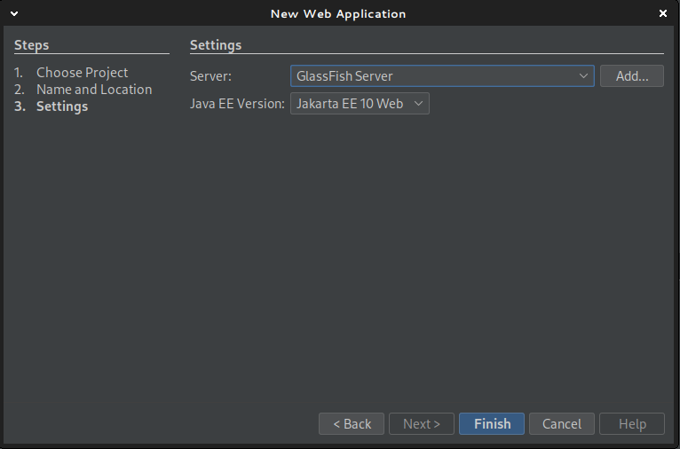

# Proyecto en Maven y Persistencia desde 0

## Creando el proyecto web




1. Crear un proyecto nuevo de Java with Maven > Web Application.
2. Name: Colocar nombre del proyecto.
3. Group Id y Version por ahora no son muy importantes.
4. Luego de elegir GlassFish y Jakarta EE 10, darle a `finish`.

## Añadir la dependencia para MySQL

1. Ir a: <https://mvnrepository.com/artifact/mysql/mysql-connector-java/8.0.33>
2. Copiar el codigo para Maven:

```xml
<!-- https://mvnrepository.com/artifact/mysql/mysql-connector-java -->
<dependency>
    <groupId>mysql</groupId>
    <artifactId>mysql-connector-java</artifactId>
    <version>8.0.33</version>
</dependency>
```
3. Abrir el `Project File/pom.xml` y añadir en `<dependencies />`.
4. Correr el proyecto (con esto, la primera vez, se va a descargar la dependencia).

## Testear la conexion a la BBDD

### 1. Crear el Datasource para Netbeans

Esta configuración es necesaria para que Glassfish defina el JDNI de la base de datos.

1. Descargar el Jar del conector: <https://mariadb.com/downloads/connectors/>: Hay que seleccionar Producto (Java).

2. Ir a Servies > click derecho en DataBases > New Connection > Seleccionar MariaDB en Driver y Add para añadir el Jar.
3. Configurar la contraseña para el root de MariaDB (y cualquier otra configuración necesaria) y principalmente la BBDD a usar.


Luego se puede probar que esta conectando a la BBDD correcta ejecutando `show tables;` y debería mostrar las tablas de la BBDD.

> [!INFO]
> Desde consola se puede ejecutar: `sudo mariadb -u root -p` (pide el pass sudo y el pass de la DDBB), luego `USE universidad;` y finalmente `SHOW TABLES;` para ver las tablas.
> Para salir se puede poner `EXIT;`

### 2. Crear el JDBC para GlassFish

Netbeans no crea automáticamente el recurso JDBC en GlassFish cuando trabajas con proyectos Maven.

- Si ya existe, el JDNI deberia poder verse en: `Services > Servers > GlassFish > Resources > JDBC > JDBC Resources`.
- Sino, hay que crearlo:
    - Abrir la consola de GlassFish (pagina web): `Services > Servers > GlassFish > View Admin Console`
    - Primero el **Connection Pool**: `Resources > JDBC > JDBC Connection Pools`:
        - Pool name: `UniversidadPool`
        - JDBC: `javax.sql.DataSource`
        - DB Driver Vendor: `MySQL` (es igual para MariaDB)
        - Ok
    - Luego el **JDBC Resource**:
        - JDNI: `jdbc/DBUniversidad`
        - Pool name: seleccionar `UniversidadPool`
        - Ok
- Hay que añadir el jar para MariaDB también en GlassFish, en: `/home/martin/glassfish/glassfish/domains/domain1/lib/ext/`
- Reiniciar GlassFish y probar ping en los Pools.

### 2. Crear la entidad Java para tabla Facultad

- Boton derecho sobre el proyecto > New > Entity Classes from Database


- 

```java
package model;

import jakarta.persistence.*;

@Entity
public class Facultad {
    @Id
    @GeneratedValue(strategy = GenerationType.IDENTITY)
    private Integer idfacultad;
    private String nombre;

    // Getters y setters
    public Integer getIdfacultad() { return idfacultad; }
    public void setIdfacultad(Integer id) { this.idfacultad = id; }
    public String getNombre() { return nombre; }
    public void setNombre(String nombre) { this.nombre = nombre; }
}
```

### 2. Configurar persistence.xml

En `src/main/resources/META-INF/persistence.xml`:

```xml
<persistence version="3.0"
             xmlns="https://jakarta.ee/xml/ns/persistence"
             xmlns:xsi="http://www.w3.org/2001/XMLSchema-instance"
             xsi:schemaLocation="https://jakarta.ee/xml/ns/persistence https://jakarta.ee/xml/ns/persistence/persistence_3_0.xsd">
  <persistence-unit name="UniversidadPU" transaction-type="JTA">
    <jta-data-source>java:app/DBUniversidad</jta-data-source>
    <exclude-unlisted-classes>false</exclude-unlisted-classes>
    <properties/>
  </persistence-unit>
</persistence>
```

### 3. Crear el servlet para consultar las facultades

```java
package controller;

import jakarta.servlet.*;
import jakarta.servlet.annotation.WebServlet;
import jakarta.servlet.http.*;
import jakarta.persistence.*;
import model.Facultad;
import java.io.IOException;
import java.util.List;

@WebServlet("/index")
public class FacultadServlet extends HttpServlet {
    @PersistenceContext(unitName = "UniversidadPU")
    private EntityManager em;

    @Override
    protected void doGet(HttpServletRequest request, HttpServletResponse response)
            throws ServletException, IOException {
        List<Facultad> facultades = em.createQuery("SELECT f FROM Facultad f", Facultad.class).getResultList();
        request.setAttribute("facultades", facultades);
        request.getRequestDispatcher("index.jsp").forward(request, response);
    }
}
```

### 4. Editar el index.jsp

```java
<%@ page import="java.util.List, model.Facultad" %>
<% List<Facultad> facultades = (List<Facultad>) request.getAttribute("facultades"); %>
<html>
<head><title>Facultades</title></head>
<body>
<h2>Facultades</h2>
<table border="1">
<tr><th>ID</th><th>Nombre</th></tr>
<% if (facultades != null) {
     for (Facultad f : facultades) { %>
  <tr>
    <td><%= f.getIdfacultad() %></td>
    <td><%= f.getNombre() %></td>
  </tr>
<%   }
   } %>
</table>
</body>
</html>
```
