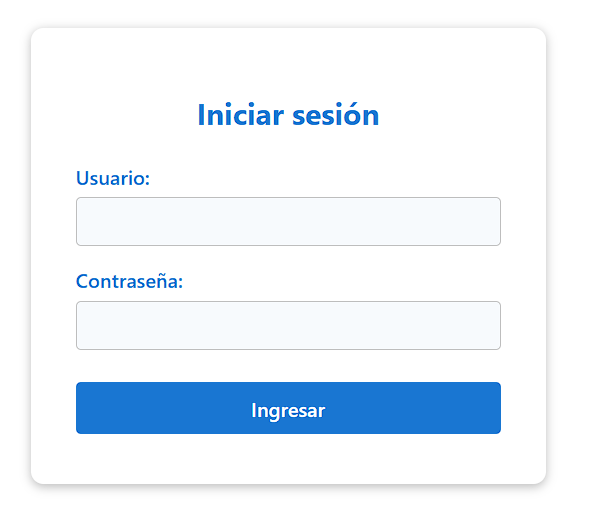
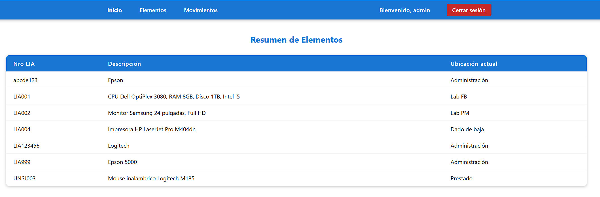
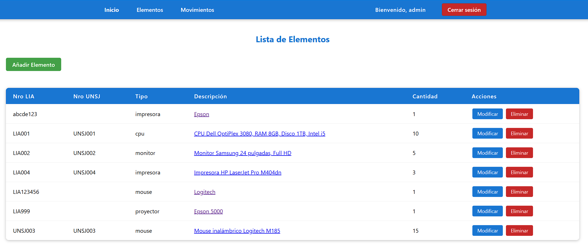
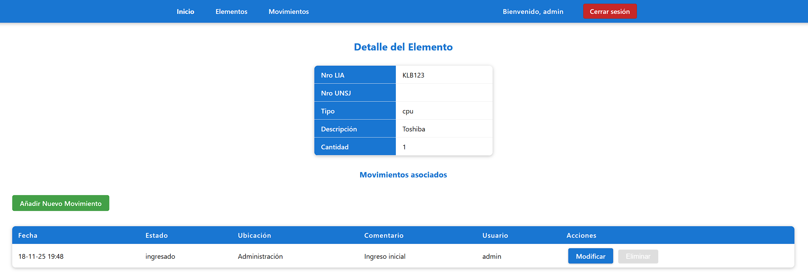

# Informe Final

## Caratula

Martín Miguel Varela Ochoa

Inventario LIA

Backend 3

2025

## Introducción

## Descripción General del Proyecto

El proyecto "Inventario LIA" es una aplicación web, desarrollada para gestionar el inventario del LIA (Laboratorio de Informática Aplicada). Su objetivo es facilitar el control y seguimiento de los recursos disponibles y sus ubicaciones dentro del LIA. Además sienta las bases para un futuro sistema de tickets que incluya una gestión automática del inventario cuando corresponda.

El sistema incluye funcionalidades clave como:

- Autenticación de Usuarios.
- Control de acceso basado en roles.
- Registro y gestión de elementos del inventario.
- Registro y seguimiento de movimientos de los elementos.
- Integración con bases de datos para almacenamiento seguro y confiable.
- Interfaz web intuitiva para facilitar el acceso y uso por parte de los usuarios.

## Contexto del Problema

El LIA necesita una solución mas eficiente que el uso de un archivo de Excel para gestionar su inventario, ya que actualmente no es posible llevar un control actualizado ni con un historial de cambios adecuado.

El proyecto "Inventario LIA" surge como una intención de dar una solución integral a estos problemas, proporcionando una herramienta tecnológica que automatiza y optimiza los procesos de inventario, mejorando la eficiencia operativa y reduciendo los errores humanos.

## Descripción Técnica

El sistema va a contar con una BBDD donde se tienen las tablas elementos, movimientos, usuarios, roles y usuarios_roles.

Existen 4 roles: user_admin (gestiona usuarios y roles), coordinador (puede modificar y borrar movimientos y elementos en el inventario), técnico (crear movimientos y añadir elementos) y revisores (pueden listar elementos).

Un elemento puede tener muchos movimientos, ya que cada movimiento representa una acción realizada sobre el elemento (alta, baja, préstamo, reclamo de garantía, etc). Los movimientos también registran quien los hizo y cuando.

## Desarrollo

### a) Requisitos Funcionales

A continuación se presentan los requisitos funcionales implementados en la aplicación monolítica Java. Cada requisito incluye: identificador, descripción, actores, precondiciones, flujo principal, entradas/salidas, endpoints/UI, reglas de negocio y criterios de aceptación.

---

#### RF-01 — Autenticación de usuarios (Login)

- **Descripción:** Permite que un usuario se autentique con nombre y contraseña.
- **Actores:** Usuario (operador, técnico, coordinador, admin).
- **Precondiciones:** Usuario existente en la base de datos.
- **Flujo principal:**
	1. GET ` /login ` → muestra `login.jsp`.
	2. POST ` /login ` con `nombre` y `password`.
	3. Validación con `UsuariosFacade.findByNombreYPassword`.
	4. Si es válido: crear sesión (`session.setAttribute("usuario")`) y cargar roles en sesión.
	5. Redirigir a `/`.
- **Entradas:** `nombre`, `password`.
- **Salidas:** sesión establecida o mensaje de error en pantalla.
- **Endpoint / UI:** `LoginServlet` (`/login`), `login.jsp`.
- **Reglas de negocio:** usuario y contraseña obligatorios; mostrar mensaje de error si no coinciden.
- **Criterio de aceptación:** con credenciales válidas el usuario inicia sesión y es redirigido; con credenciales inválidas se muestra `login.jsp` con mensaje de error.

---

#### RF-02 — Cierre de sesión (Logout)

- **Descripción:** Finalizar la sesión del usuario.
- **Actores:** Usuario autenticado.
- **Precondiciones:** Sesión activa.
- **Flujo:** GET ` /logout ` → invalidar sesión (`session.invalidate()`), redirigir a `login.jsp`.
- **Endpoint / UI:** `LogoutServlet` (`/logout`).
- **Criterio de aceptación:** tras `/logout` la sesión ya no existe y el usuario ve el login.

---

#### RF-03 — Visualizar listado de elementos

- **Descripción:** Mostrar la lista de elementos inventariados.
- **Actores:** Usuario autenticado (según permisos).
- **Precondiciones:** Sesión activa (cuando aplica).
- **Flujo:** GET ` /elementos ` (sin `accion`) → `ElementosServlet` obtiene `elementosFacade.findAll()` → forward a `elementos.jsp` con `lista`.
- **Entradas / Salidas:** (Opcional: parámetros de filtrado). Salida: tabla/listado de elementos.
- **Endpoint / UI:** `ElementosServlet` + `elementos.jsp`.
- **Criterio de aceptación:** `elementos.jsp` muestra una fila por cada elemento en la BD.

---

#### RF-04 — Crear nuevo elemento

- **Descripción:** Registrar un nuevo elemento en el inventario.
- **Actores:** Usuario con privilegios (`tecnico`, `user_admin`).
- **Precondiciones:** Sesión activa y permisos adecuados.
- **Flujo:**
	1. Formulario en `nuevoelemento.jsp`.
	2. POST ` /elementos ` con `accion=crear` y campos: `nroLia`, `nroUnsj`, `tipo`, `descripcion`, `cantidad`.
	3. `ElementosServlet` crea entidad `Elementos` y llama a `elementosFacade.create(e)`.
	4. Se crea un `Movimientos` inicial (estado `ingresado`, ubicación por defecto, usuario admin) y se persiste.
	5. Redirigir a `/elementos`.
- **Reglas:** `nroLia` identifica al elemento; `cantidad` numérico; validaciones en servidor.
- **Endpoint / UI:** `ElementosServlet (accion=crear)` y `nuevoelemento.jsp`.
- **Criterio de aceptación:** el nuevo elemento aparece en el listado y existe un movimiento inicial asociado.

---

#### RF-05 — Editar elemento

- **Descripción:** Modificar datos de un elemento existente.
- **Actores:** Usuario con permisos.
- **Precondiciones:** Elemento existente.
- **Flujo:**
	1. GET `/elementos?accion=editar&nroLia={id}` → `ElementosServlet` carga el elemento y forward a `editarelemento.jsp`.
	2. POST `/elementos` con `accion=modificar` y datos actualizados.
	3. `elementosFacade.edit(e)` y redirección a `/elementos`.
- **Criterio de aceptación:** cambios persistidos y visibles en el listado.

---

#### RF-06 — Eliminar elemento

- **Descripción:** Eliminar un elemento del inventario.
- **Actores:** Usuario con permisos.
- **Precondiciones:** Elemento existente.
- **Flujo:** POST/GET a `/elementos?accion=eliminar&nroLia={id}` → `elementosFacade.remove(e)` → redirigir a `/elementos`.
- **Criterio de aceptación:** elemento eliminado y ya no aparece en la lista.

---

#### RF-07 — Ver detalle de un elemento

- **Descripción:** Mostrar la ficha completa del elemento y su histórico de movimientos.
- **Actores:** Usuario autenticado.
- **Flujo:** GET `/detalleelemento?nroLia={id}` → `DetalleElementoServlet` obtiene `elemento` y `movimientosFacade.findByNroLia(elemento)` → forward a `detalleelemento.jsp`.
- **Salida:** detalle del elemento y lista de movimientos.
- **Criterio de aceptación:** la página muestra movimientos y datos actuales.

---

#### RF-08 — Listado de movimientos

- **Descripción:** Ver todos los movimientos registrados.
- **Actores:** Usuario autenticado.
- **Flujo:** GET `/movimientos` → `MovimientosServlet` obtiene `movimientosFacade.findAll()` → forward a `movimientos.jsp`.
- **Criterio de aceptación:** `movimientos.jsp` lista movimientos con fecha, estado, usuario y elemento.

---

#### RF-09 — Crear movimiento

- **Descripción:** Registrar un nuevo movimiento (traslado, ingreso, baja, etc.).
- **Actores:** Usuario con permisos.
- **Precondiciones:** Elemento seleccionado y usuario asignado.
- **Flujo:**
	1. GET `/movimientos?accion=nuevo` → preparar listas (`elementos`, `usuarios`) → `nuevomovimiento.jsp`.
	2. POST `/movimientos` con `accion=crear` y campos: `nroLia`, `nroUnsj`, `estado`, `ubicacion`, `comentario`, `userId`.
	3. `movimientosFacade.create(m)` y redirigir a `/movimientos`.
- **Criterio de aceptación:** nuevo movimiento en el listado y en el detalle del elemento.

---

#### RF-10 — Editar movimiento

- **Descripción:** Modificar un movimiento existente.
- **Actores:** Usuario con permisos.
- **Flujo:** GET `/movimientos?accion=editar&id={id}` → mostrar `editarmovimiento.jsp` → POST `accion=modificar` → `movimientosFacade.edit(m)`.
- **Criterio de aceptación:** cambios guardados y visibles.

---

#### RF-11 — Eliminar movimiento

- **Descripción:** Borrar un movimiento por su id.
- **Actores:** Usuario con permisos.
- **Flujo:** GET/POST `/movimientos?accion=eliminar&id={id}` → `movimientosFacade.remove(m)`.
- **Criterio de aceptación:** movimiento eliminado.

---

#### RF-12 — Gestión de usuarios (API REST)

- **Descripción:** Endpoints REST para CRUD de usuarios (JSON).
- **Actores:** Administrador / sistemas integrados.
- **Endpoints (ejemplos):**
	- `GET /api/usuarios` → lista JSON
	- `GET /api/usuarios/{id}` → usuario
	- `POST /api/usuarios` → crear
	- `PUT /api/usuarios/{id}` → actualizar
	- `DELETE /api/usuarios/{id}` → eliminar
- **Implementación:** `UsuariosResource.java` que usa `UsuariosFacade` (`@EJB`).
- **Criterio de aceptación:** endpoints aceptan/retornan JSON y persisten cambios.

---

#### RF-13 — Gestión de roles (API)

- **Descripción:** Endpoints REST para consultar y gestionar roles.
- **Endpoints:** `GET /api/roles`, `GET /api/roles/{id}`, etc.
- **Archivo:** `RolesResource.java`, `RolesFacade.java`.

---

#### RF-14 — Gestión de elementos y movimientos (API)

- **Descripción:** Endpoints REST para operaciones CRUD sobre `Elementos` y `Movimientos`.
- **Archivos:** `ElementosResource.java`, `MovimientosResource.java`.

---

#### RF-15 — Soporte CORS para la API

- **Descripción:** Permitir peticiones cross‑origin desde el frontend Svelte.
- **Implementación:** `CORSFilter` declarado en `WEB-INF/web.xml` (`com.martindev.inventariolia.filters.CORSFilter`).
- **Criterio de aceptación:** peticiones `OPTIONS` responden `200` y llamadas AJAX cross‑origin funcionan.

---

#### RF-16 — Páginas principales y navegación

- **Descripción:** Renderizado server‑side de páginas JSP: `index.jsp`, `elementos.jsp`, `movimientos.jsp`, `detalleelemento.jsp`, formularios (`nuevoelemento.jsp`, `nuevomovimiento.jsp`, `editarelemento.jsp`, `editarmovimiento.jsp`) y `login.jsp`.
- **Criterio de aceptación:** cada JSP muestra los datos proporcionados por los servlets y permite las acciones CRUD.

---

#### RF-17 — Persistencia y transacciones

- **Descripción:** Todas las operaciones de negocio persisten vía JPA mediante facades EJB transaccionales.
- **Implementación:** `*Facade.java` con `@Stateless` y `@PersistenceContext` (unidad `InventarioLiaPU`).

---

#### RF-18 — Logs / Consola

- **Descripción:** Registro básico en consola (p. ej. roles en sesión en `LoginServlet`).
- **Mejora recomendada:** reemplazar `System.out.println` por un logger (SLF4J / Jakarta Logging).

---

#### RF-19 — Filtros: encoding y seguridad básica

- **Descripción:** `EncodingFilter` (UTF‑8) y `CORSFilter` (CORS) declarados en `web.xml`.
- **Archivos:** `src/main/java/com/martindev/inventariolia/filters/EncodingFilter.java`, `CORSFilter.java`.

---

#### RF-20 — Páginas estáticas y assets

- **Descripción:** Recursos estáticos (imágenes, css, js) servidos desde `src/main/webapp`.
- **Criterio de aceptación:** recursos accesibles desde JSP por rutas relativas.

---

### Guía Básica para el Usuario

Ingresar a: `http://localhost:8080/InventarioLia/`. Esto redirigirá a la página de login donde se debe ingresar el nombre de usuario y la contraseña. Una vez autenticado, el usuario podrá acceder a las diferentes funcionalidades del sistema según su rol asignado.

> [!INFO]
> Hay 4 usuarios predefinidos: admin/1234, tecnico/1234, coordinador/1234, revisor/1234.

Cuando se realiza un login exitoso, el usuario es redirigido a la página **Inicio** donde se listan los elementos y sus ubicaciones actuales. En esta pagina no es posible realizar ninguna acción.

Los usuarios con rol técnico puede acceder a la página **Elementos**, donde puede ver los elementos, sus detalles y añadir nuevos elementos. Pero no puede editar ni eliminar, por motivos de seguridad. Solo los usuarios con rol coordinador pueden editar y eliminar elementos.

Finalmente, los usuarios con rol coordinador también puede acceder a la página **Movimientos**, donde pueden gestionar los movimientos de los elementos.

Añadir elemento mostrará un formulario para ingresar los datos del nuevo elemento. Al añadir un nuevo elemento, por defecto se crea un movimiento inicial con estado "ingresado" y ubicación "LIA".

Además, cuando solo existe 1 movimiento para un elemento, ese movimiento no puede ser eliminado, solo se elimina cuando es también eliminado el elemento asociado.

### b) Modo de Uso

### c) Representación Visual

## Especificaciones Técnicas

### a) Diagrama Entidad–Relación

### b) Modelo Orientado a Objetos

### c) Descripción Tecnológica

Para poder cumplir con los requisitos de las cátedras Backend 3 y Frontend, se optó por trabajar en un proyecto que se divide en 3 partes:

- Fullstack web application en Java, con las tecnologías JSP con JSTL, Servlets, Facades (EJBs stateless), Entidades JPA y API Criteria, Maven como gestor de dependencias, GlassFish como servidor de aplicaciones y una base de datos MariaDB.
- Backend RESTful API en Java, que reutiliza las Entidades JPA y los facades, reemplazando a los Servlets por resources JAX-RS, para ser consumida por un frontend desacoplado del proyecto en Java.
- Frontend web application en Svelte, que consume la API RESTful.

## Conclusiones

El desarrollo del proyecto "Inventario LIA" ha sido una experiencia enriquecedora y desafiante. A pesar de haber trabajado previamente con arquitecturas como Laravel y .NET, trabajar con Java representó un reto significativo debido a su curva de aprendizaje más elevada. La cantidad de herramientas y tecnologías involucradas, como GlassFish, JPA, Maven, API Criteria, paquetes y dependencias, hizo que el proceso fuera complejo. Sin el apoyo de herramientas como la inteligencia artificial, habría sido difícil alcanzar los objetivos planteados.

Uno de los aprendizajes más destacados fue la implementación de autenticación y autorización utilizando JWT. Este fue un tema completamente nuevo para mí, y el hecho de tener que desarrollarlo desde cero con una API propia añadió un nivel adicional de dificultad. Sin embargo, este desafío me permitió adquirir conocimientos valiosos y mejorar mis habilidades como desarrollador.

En conclusión, este proyecto no solo me permitió desarrollar una solución tecnológica útil para la gestión de inventarios, sino que también me ayudó a crecer profesionalmente al enfrentar y superar obstáculos técnicos significativos.
