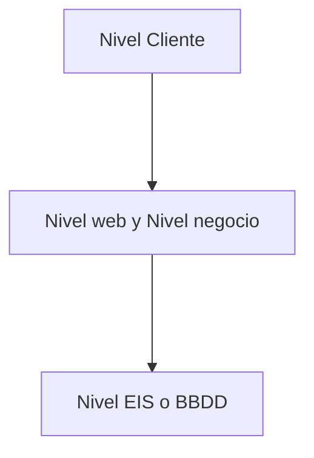

# Clase 03: Java EE y Componentes Web

Bienvenidos a la tercera clase de Backend. Hoy vamos a conocer la plataforma Java EE, sus componentes y el proceso de desarrollo de aplicaciones web empresariales. Cada concepto se explica de forma sencilla para facilitar el aprendizaje.

---

## 1. ¿Qué es Java EE?

Java EE (Enterprise Edition) es una plataforma que ayuda a crear aplicaciones empresariales grandes, seguras y escalables. Permite que los programas funcionen en diferentes sistemas y aprovechen la velocidad y seguridad de los servidores.

**Explicación:**
Java EE es ideal para empresas que necesitan aplicaciones robustas, rápidas y confiables, como bancos, comercios y sistemas de gestión.

---

## 2. Modelo de Aplicación Java EE

Java EE utiliza un modelo distribuido de varios niveles. Esto significa que la aplicación se divide en partes (componentes) según su función, y cada parte puede ejecutarse en diferentes computadoras.

**Explicación:**
Separar la aplicación en niveles permite que cada parte se especialice y sea más fácil de mantener y escalar.

---

## 3. Tipos de Aplicaciones Web

- **Orientada a Presentación:** Genera páginas web interactivas para el usuario.
- **Orientada a Servicios:** Implementa servicios web que otros sistemas pueden usar (por ejemplo, APIs REST o SOAP).

**Explicación:**
Las aplicaciones pueden mostrar información al usuario o servir datos a otros sistemas.

---

## 4. Componentes de Java EE

Java EE define varios tipos de componentes:
- **Aplicaciones cliente y applets:** Se ejecutan en el dispositivo del usuario.
- **Servlet, JSP y JSF:** Componentes web que se ejecutan en el servidor y generan páginas dinámicas.
- **JavaBeans:** Componentes de negocio que contienen la lógica de la empresa.

**Explicación:**
Cada componente tiene una función específica y trabaja en conjunto para crear la aplicación completa.

---

## 5. Niveles de la Arquitectura Java EE

- **Nivel Cliente:** Donde está el usuario (aplicación cliente o web).
- **Nivel Web:** Servidor que maneja la interfaz (JSF, JSP).
- **Nivel Negocio:** Servidor que maneja la lógica (JavaBeans).
- **Nivel EIS:** Servidor de base de datos (Enterprise Information System).

**Explicación:**
Cada nivel se encarga de una parte diferente del sistema, facilitando la organización y el mantenimiento.

---

## 6. Clientes Web vs Aplicaciones Cliente

- **Cliente Web:** Accede a la aplicación a través de un navegador y pasa por el nivel web antes de llegar al negocio.
- **Aplicación Cliente:** Se conecta directamente al nivel de negocio.

**Explicación:**
El cliente web es más común y fácil de usar, mientras que la aplicación cliente puede tener acceso directo a funciones avanzadas.

---

## 7. Componentes Web

- **Servlet:** Clases Java que procesan peticiones y generan respuestas dinámicas.
- **Java Server Page (JSP):** Documentos de texto que permiten mezclar contenido estático y dinámico.
- **Java Server Face (JSF):** Framework para construir interfaces de usuario sobre servlets y JSP.

**Explicación:**
Estos componentes permiten crear páginas web interactivas y personalizadas para los usuarios.

---

## 8. Componentes de Negocio (JavaBeans)

JavaBeans contienen la lógica que resuelve las necesidades de la empresa, como procesamiento de transacciones y acceso a bases de datos.

**Explicación:**
Son el "cerebro" de la aplicación, donde se toman las decisiones y se procesan los datos.

---

## 9. Componentes y Contenedores

- **Componentes Web:** Unidades de software como Servlets y JSP (junto con JavaBeans).
- **Contenedores Web:** Programas que ejecutan los componentes y gestionan sus funciones (ejemplo: Tomcat, GlassFish, Resin).

**Explicación:**
El contenedor es como el "motor" que hace funcionar los componentes y les da acceso a servicios como seguridad y manejo de sesiones.

---

## 10. Proceso de Desarrollo en NetBeans

1. **Escribir y compilar el código:** Crear la estructura de carpetas, escribir el código y compilarlo.
2. **Crear recursos estáticos:** Añadir páginas HTML e imágenes que usará la aplicación.
3. **Crear el descriptor de despliegue (web.xml):** Archivo que indica cómo se debe desplegar la aplicación.
4. **Construir la aplicación:** Compilar y empaquetar todo en un archivo .war listo para desplegar.
5. **Desplegar la aplicación:** Subir el archivo .war o la carpeta al contenedor web para que los usuarios puedan acceder.

**Explicación:**
NetBeans facilita cada paso, ayudando a organizar el proyecto y automatizar tareas como la compilación y el despliegue.

---

## 11. Detalles de cada paso

### 1. Escribir y compilar
- Separar el código fuente del compilado.
- Usar build.xml para automatizar tareas.

### 2. Crear recursos estáticos
- Páginas HTML e imágenes que se usan en la web.

### 3. Descriptor de despliegue
- web.xml contiene instrucciones para el contenedor web.
- No es necesario si solo hay HTML e imágenes.

### 4. Construir la aplicación
- Compilar los archivos y guardarlos en carpetas específicas.
- Crear el archivo .war para desplegar.

### 5. Desplegar la aplicación
- Subir el archivo .war o la carpeta al servidor.
- Usar .war para despliegue remoto.

**Explicación:**
Estos pasos aseguran que la aplicación esté lista para funcionar en cualquier servidor compatible con Java EE.

---

