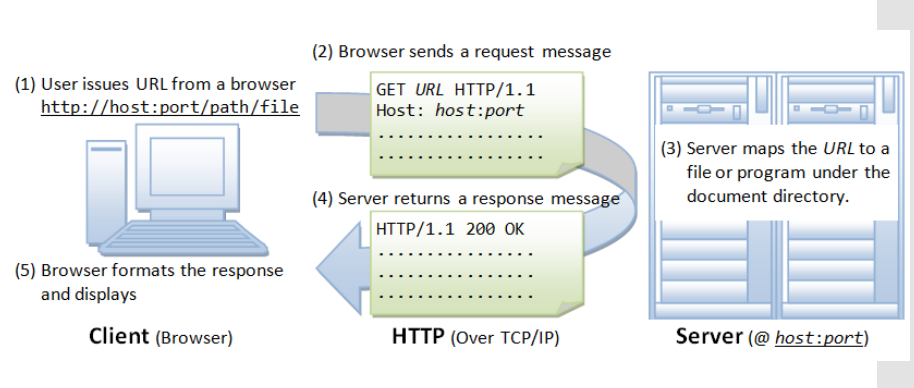

# Internet & WorldWide Web

## Internet

“ Conjunto descentralizado de redes de comunicación
interconectadas que utilizan la familia de protocolos
TCP/IP, lo cual garantiza que las redes físicas
heterogéneas que la componen, formen una red lógica
única de alcance mundial. “
Sus orígenes se remontan a 1969, cuando se estableció la primera
conexión de computadoras, conocida como ARPANET, entre tres
universidades en California (Estados Unidos)

## Servicios de Internet (TCP/IP)

 El envió de correo electrónico (SMTP),
 La transmisión de archivos (FTP y P2P),
 Las conversaciones en línea (IRC),
 La mensajería instantánea y presencia,
 La transmisión de contenido y comunicación multimedia —
telefonía (VoIP), televisión (IPTV),
 Los boletines electrónicos (NNTP),
 El acceso remoto a otros dispositivos (SSH y Telnet)
 Los juegos en línea
 La Word Wide Web (HTTP)

## La web: HTTP sobre TCP/IP

1. (Client browser) User issues URL from a browser: http://host:port/path/file
2. (HTTP over TCP/IP) Browser sends a request message: GET URL HTTP/1.1 Host: host:port ...
3. (Server) Server maps the URL to a file or program under the document directory
4. (HTTP over TCP/IP) Server returns a response message: HTTP/1.1 200 OK ...
5. (Client browser) Browser formats the response and displays



## World Wide Web Consortium

Comunidad internacional que
establece los estándares para el
desarrollo Web

Las especificaciones HTTP son mantenidas por W3C (World-wide Web Consortium)

Web Design and Applications
Web of Devices
Web Architecture
SemanticWeb
XML Technology
Web of Services
Browsers and AuthoringTools

## Desarrollo Web

Usuario > Navegador > Datos > Servidor > JSON/HTML/XML > Navegador

Front End: Paginas web, webapps, apps, juegos. HTML, CSS, Javascript.
Back End: Base de datos, mail, generacion de archivos. Lenguaje del servidor.

## Front-End

 Maquetación - Responsive Design
"Make it as simple as possible, but not simpler."
Albert Einstein
 Control de Interacción - Js
 Gestión de datos - Ajax
 Conexión con servicios web – Peticiones html
 Animación – CSS3
 Search engine optimization - SEO
 Accesibilidad -WAI
 Usabilidad
“Disciplina que estudia la forma de diseñar sitios web para que
los usuarios puedan interactuar de la forma más fácil, cómoda e
intuitiva...”

## HTML

Esqueleto del frontend
Contenedor de la información de la página
Soporte de la interfaz
Estructura semántica de los contenidos

 Primer estándar fue la versión html 2
▪ Sin tablas
▪ Html, head, body no obligatorias
 Primer estándar recomendado por W3C html 3.2
 Luego apareció html 4 - Conocido como html tiene la mayor parte
de la etiquetas.
 Xhtml –Ampliación del HTML a XML (definido por W3C) -
Extensible Markup Language.
 HTML 5.
     Impulsado por WHATWG -Apple, Mozilla, Opera
     Reglas claras a los navegadores
     Nuevas etiquetas semánticas.
     Nuevo control de errores: + fácil - css - js
     Orientado a la creación de aplicaciones

## Estructura del HTML5

```html
<!DOCTYPE html>
<html lang="en">
<head>
<meta charset="UTF-8">
<title>Untitled Document</title>
<link rel=
"stylesheet" href="/css/main.css">
</head>
<body>
<div id=“main_wrapper”>
<header></header>
<div id=“main_container” > </div>
<footer></footer>
</div>
</body>
</html>
```

## DOM o Modelo de Objetos del Documento

...

## CSS

Inicialmente:
etiqueta { }
#identificador { }
.clase { }
etiqueta.clase { } // Etiqueta con una clase concreta
etiqueta .clase { } // Anidación de elementos
etiqueta, .clase { } // Aplica a un grupo
#identificador.modificador { } // Cambiar aspecto

Fue evolucionando y añadio:
Bordes especiales
Mayor control sobre imágenes de fondo
Composición de fondos
Sombras
Transformaciones
Animaciones

## Javascript

Es un lenguaje que permite que la página
interactúe con el usuario.
Maneja contenido dinámico en el cliente.
No se relaciona con el lenguaje java.
Débilmente tipado.
Potente para crear páginas dinámicas.
Una página basada en estándares
se comporta de la misma manera en
cualquier browser. 

## ID y CLASS en html, css y javascript

...