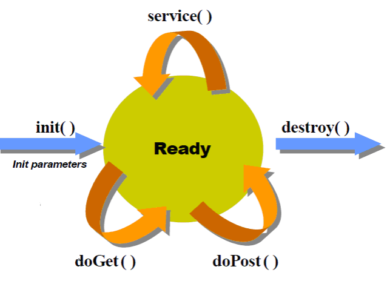

# Componentes Web: Servlets

## Que son los Servlets?

 Son objetos Java que extienden las
funcionalidades de un servidor HTTP creando
contenido dinámico.  Basado en un modelo de programación
requerimiento
-respuesta.
 Permite ampliar las aplicaciones alojadas en el
servidor web.

## Ejemplo de Servlet

```java
@WebServlet(urlPatterns = {"/MiServlet"})
public class MiServlet extends HttpServlet {
public void processRequest (Http... request, Http..
response){
response.setContentType("text/html");
PrintWriter out = response.getWriter();
out.println("<title>Hello World!</title>");}
@Override
public void doGet(HttpServletRequest request,
HttpServletResponse response){
processRequest (request, response); }
@Override
public void doPost(HttpServletRequest
request,HttpServletResponse response){
processRequest (request, response); }
…
}
```

## Modelo Requerimiento-Respuesta (Resquest-Response)

Una petición HTTP contiene:
 Encabezado
 Un método HTTP:
 Get: Los datos del formulario de entrada se pasan
como parte del URL.
 Post: Los datos del formulario de entrada se pasan
dentro del cuerpo del mensaje.
 Datos

Requerimiento:
Es la información que transmite el cliente al
servidor, a través del encabezado HTTP.
Respuesta:
Es la información (texto-html o binarioimagen) que el servidor le transmite al cliente a
través del encabezado HTTP.

 Recibe el requerimiento del cliente
(en forma de requerimiento HTTP)
 Extrae la información del objeto
request
 Procesa la lógica del negocio
(realiza accesos a la BD, invocando
EJBs, web services etc)
 Crea y transmite la respuesta al
cliente (en la forma de respuesta
HTTP) o envía el objeto response
a otro servlet o página.

## Metodos HTTP mas comunes

Métodos HTTP mas comunes:
 Solicitud GET:
 La información completa del usuario es
agregada al URL como una consulta
string.
 Puede transmitirse solamente una
cantidad de datos limitada como
parámetros de la consulta.
…./Ejemplo/MiServlet?param1=Susana&param2=Chavez
&param3=Susy&Enviar=Enviar
 Solicitud POST:
 La información completa del usuario es
transmitida como un dato (no se
agrega al URL)
 Puede transmitir cualquier cantidad de
datos.

Comparativa GET POST
Datos Los datos del cliente se agregan al
URL
Se transmiten separados del URL
Almacenamiento en el
history del
browser
Como los datos son agregados al URL
deben ser almacenados en el
historial
No se almacenan en el historial del
browser
Bookmark
La URL con los datos del cliente
puede ser marcada. De esta manera,
más tarde sin llenar el formulario
HTML, se pueden enviar los mismos
datos al servidor.
No es posible bookmark
Tamaño Limitado a 2048 caracteres
(dependiendo del browser)
Sin limites
Hacking
Fácil de piratear los datos ya que los
datos se almacenan en el historial
del navegador
Difícil
Tipo de
datos
Solo se pueden enviar datos ASCII Se puede enviar cualquier tipo de
datos, incluidos los datos binarios
Privacidad
Los datos no son secretos ya que
otras personas pueden ver los datos
en el historial del navegador
Son privados
Cuando usar
Cuando los datos enviados no son
secretos. Como son las contraseñas.
Conviene cuando los datos son
críticos y confidenciales
Performance Relativamente más rápido Se creará un cuerpo de mensaje por
separado
Por defecto Si no se menciona, GET se supone
como predeterminado
Se debe mencionar explícitamente

## Ciclo de Vida de un Servlet

El ciclo de vida de un servlet esta
controlado por el contenedor para:
1.Si no existe una instancia del
servlet:
a)Carga la clase servlet.
b)Crear una instancia de la clase
servlet.
c)Inicializa el objeto llamando al
método init.
2.Invoca el método service, pasando
los objetos request y response.
3.Al cerrar la aplicación, el
contenedor finaliza el servlet
llamando al método destroy.




## Métodos del ciclo de vida

El contenedor controla el ciclo de vida del
servlet:
 init(): Se invoca una sola vez cuando el
servlet es instanciado.
 Se realizan las conecciones a la BD.
 destroy(): Se invoca antes de borrar el
servlet
 Cierra las conecciones a la BD.
 service():
 Método abstracto en
javax.servlet.GenericServlet e
implementado en
javax.servlet.http.HttpServlet
 Invoca a doGet(), doPost()
 No se debe sobrescribir!!!
 doGet(), doPost():
 Definidos en
javax.servlet.http.HttpServlet
 Maneja las solicitudes GET, POST de
HTTP
 Se deben implementar para que tengan
el comportamiento deseado.