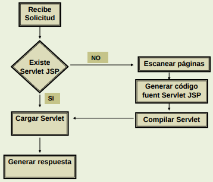

# Componentes Web: JSP (Java Server Page)

## Que son los JSP?

Componentes dinámicos en la plataforma Java EE.

Es un documento basado-texto capaz de retornar
contenidos estáticos y dinámicos al browser del
cliente.
Expresado en formato: HTML, XML, WML.
Elementos JSP que agrega: Código Java, Despliega propiedades beans, Invoca lógica del negocio definida en etiquetas personalizadas.

La extensión de los documentos es .jsp

## Ejemplo de JSP

```jsp
<body>
<h1>Hola !!!</h1>
<br>
<h2>Hoy es <%= new java.util.Date() %></h2>
</body>
```

```jsp
<%@page import="java.util.Date"%>
<%@page import="java.util.Locale"%>
<%@page import="java.text.DateFormat"%>
<!DOCTYPE html>
<html>
<body>
<h1>Hola !!!</h1>
<br>
<h2>Hoy es
<%= (DateFormat.getDateTimeInstance(
DateFormat.LONG,
DateFormat.LONG,
Locale.getDefault()).format(new Date())) %>
</h2>
</body>
</html>
```

```jsp
<%@page contentType="txt/html" pageEncoding="UTF-8" %>
<%@page import="java.util.Date"%>
<%@page import="java.text.SimpleDateFormat"%>
<% // Formato fecha
SimpleDateFormat forma =
new java.text.SimpleDateFormat(“
'Hoy es’ EEEEEEEEE dd 'de' MMMMM 'de' yyyy");
String fecha = forma.format(new Date());
%>
<!DOCTYPE html>
<html>
<body>
<h1>Hola !!!</h1>
<br>
<h2> <%= fecha%> </h2>
</body>
</html>
```

## Como funcionan los JSP

 El contenedor busca etiquetas JSP, generando el
código Java correspondiente para cada una de ellas.
 Las etiquetas estáticas HTML son convertidas a
Strings de Java.
 Las etiquetas que hacen referencia a JavaBeans son
traducidas en los correspondientes objetos y llamadas
a métodos.
 Se construye el código del servlet (se codifica su
método service()).
 Se llama al compilador de Java para compilar el código
fuente y añade el fichero de bytecodes resultante al
directorio apropiado del contenedor JSP.
El contendor invoca al servlet para generar la respuesta
al usuario



## Pros de los JSP

 Contenido y lógica están separadas.
 Simplifica el desarrollo de aplicaciones
web.
 Soporta reuso de software a través de
componentes (JavaBeans).
 Despliegue automático:
– Recompile automáticamente cuando
los cambios se hacen a la página.
 Muy fácil para los que conocen HTML.
 Es Plataforma-independiente.

## Ventajas de los JSP sobre los Servlets

 Servlets pueden hacer muchas cosas, pero cuesta:
– Usar println() para generar página HTML.
– Mantener la página HTML
 Para compilar no necesita setear CLASSPATH

 La fortaleza del Servlet es “controlar y despachar”
 La fortaleza de JSP es “desplegar”
En un ambiente de producción, ambos son usados en
el patrón MVC (Model-View-Controller)
 Servlet es el controlador
 JSP es la vista

## Elementos JSP

 Directive: Proveen información acerca del JSP, no
producen ninguna salida.
 Scripting: Manejan objetos y realizan cálculos
(incluyen código java).
 Action: Permite que la página realice alguna acción.

### Directives

Las especificaciones JSP define dos sintaxis:
 La sintaxis estándar JSP.
 La sintaxis XML para usar en páginas XHTML.
 page - especifica atributos de la página:
<%@page contextType:”text/html; ISO-8859-1”
language=“java” %>
<jsp:directive.page contextType:”text/html; ISO-8859-1”
language=“java” />
 include - permite incluir otras páginas
(HTML, XHTML, JSP):
<%@ include file=”cabecera.jsp” %>
<jsp:directive.include file=”cabecera.jsp” />
 Para ampliar la librería de etiquetas:
<%@ taglib uri=“http://java.sun.com/jstl/core” prefix=“c” %>
<jsp:root xmlns:c uri=“http://java.sun.com/jstl/core” />

### Scripting

 declaration permite declarar
variables o métodos java:
<%! ArrayList libros = new ArrayList(); %>
<jsp:declaration>ArrayList libros = new ArrayList();
</jsp:declaration>
 scriptlet permite escribir código java:
<% libros.add(new Libro(“Martin Ffierro”, “Jose Hernandez”));
%>
<jsp:scriptlet> libros.add(new Libro(“Martin Ffierro”, “Jose
Hernandez”)); </jsp:scriptlet>
 expression permite mostrar un
resultado:
<%= unLibro.getNombre(); %>
</jsp:expression> unLibro.getNombre(); </jsp:expression>

### Actions

 useBean: asocia la instancia de un objeto a una variable.
 setProperty: setea el valor de una propiedad a un bean.
 getProperty: despliega el valor de una propiedad de un bean.
 include: permite incluir recursos estáticos y dinámicos.
 forward: Despacha el requerimiento a otro recurso (JSP o Servlet)
 param: Es parte de include y forward.
 plugin: Permite a un JSP generar HTML que descargará un plugin
 params: Es parte de plugin.
 element: dinámicamente define el valor de una etiqueta XML.
 attribute: define un atributo XML. Es parte de element.
 body: Define el cuerpo de un elemento XML. Es parte de element

## JSTL (JavaServer page Standard Tag Library)

Encapsula funcionalidad común en
muchas aplicaciones JSTL permite usar un
conjunto de etiquetas standards.
Asegurando que la aplicación correrá en
cualquier contenedor JSP que soporte
JSTL.

Área Funcional URI Prefijo
Básicas http://java.sun.com/jsp/jstl/core c
Procesam. XML http://java.sun.com/jsp/jstl/xml x
Fomateo http://java.sun.com/jsp/jstl/fmt fmt
Acceso DB http://java.sun.com/jsp/jstl/sql sql
Funciones http://java.sun.com/jsp/jstl/functions fn

### Area funcional basica (c)

Acción Descripción
<c:out> Evalúa una expresión y muestra el resultado.
<c:set> Setea un valor para un objeto.
<c:remove> Borra una variable.
<c:catch> Captura una excepción arrojada por alguna acción.
<c:if> Evalúa si una expresión es verdadera.
<c:choose> Proporciona condiciones mutuamente exclusivas
(Switch)
<c:when> Es parte de choose.
<c:otherwise> Es parte de choose.
<c:forEach> Repite un bloque un nro fijo de veces.
<c:forTokens> Itera según un delimitador determinado.
<c:import> Importa un recurso.
<c:url> Codifica un URL.
<c:param> Agrega parámetros a un URL.
<c:redirect> Redirecciona aun URL específico.

### Area funcional de formateo (frm)

Acción Descripción
<fmt:message> Permite enviar un mensaje.
<fmt:param> Es parte de message.
<fmt:bundle> Determina un recurso bundle
(paquete).
<fmt:setLocate> Configura la zona
<fmt:requestEncoding> Configura la codificación del
requerimiento.
<fmt:timeZone> Especifica la zona horaria.
<fmt:setTimeZone> Configura la zona horaria.
<fmt:formatNumber> Formatea un valor numérico.
<fmt:parseNumber> Convierte la representación de String a
numero.
<fmt:formatDate> Da formato de fecha y hora según la
zona local.
<fmt:parseDate> Convierte la representación de String
a fecha y hora.

## Componentes JavaBeans

 Son clases Java.
 Fácilmente reusables.
 Cualquier clase Java que siga ciertas convenciones
de diseño es una componente JavaBeans.
 La tecnología JavaServer Pages soporta
componentes JavaBeans.

 Una clase Beans debe contener al menos un
constructor sin argumentos.
 Las variables de instancia no pueden ser públicas.
 Los valores deben accederse a través de métodos
getXxx y setXxx. 

Ejemplo de uso:

```jsp
<html>
<jsp:useBean id=
"libro" scope=
"session"
class=
“modelo.Libros" />
<jsp:setProperty name="libro" property="*" />
<%
 libro.processRequest(request);
%>
….
```

`<jsp:useBean id="libro" scope="session" class=“modelo.Libros" />`
 Es equivalente a la sentencia que crea una
instancia de la clase Libros: Libros libro = new
Libros();
 Se define el alcance del Beans en el atributo
scope, que permite que el beans se asocie con
otras páginas, es decir, define como compartir el
beans.
La acción jsp:useBean establece que se
generará la instancia del nuevo objeto solo si
no hay uno generado en el mismo ámbito con el
mismo nombre.

`<jsp:setProperty name="libro" property="*" />`
“Asocia todas las propiedades del beans con los
parámetros de entrada”
 Tanto el nombre de la propiedad como el
parámetro deben coincidir exactamente.
 Cuando falta un parámetro no se realiza ninguna
acción. El sistema no asigna null por defecto.
 Se realiza conversión automática de tipo.
 Algunos contendores fallan con la conversión de
tipo Double.

## Alcance de los beans

 page
Es el valor predeterminado. El objeto beans
esta disponible a través del objeto
pageContext.
 session
El beans es almacenado en HttpSession.
 application
El beans es almacenado en el ServletContext,
es compartido por todos los servlets de la
misma aplicación.
 request
El beans es almacenado en el objeto
ServletRequest

